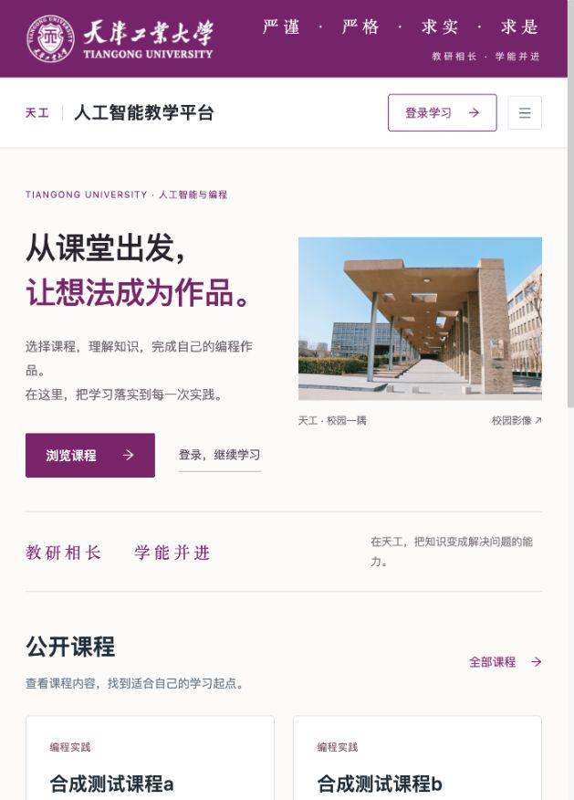

# 天工 · 人工智能教学平台

**从课堂出发，让想法成为作品。**

天工是我们持续开发和维护的人工智能与编程教学平台。项目围绕“课程学习 → 编程实践 → 作业提交 → 教师反馈”组织教学，连接学生、教师和管理员，让课程内容、学习作品和课堂管理在同一系统中完成。

平台采用天工紫与天津工业大学校园视觉，提供适配桌面和手机的课程入口、学习页面及教学工作台。代码仓库名称为 **TeachingOpen**。



## 项目功能

### 学生学习

- 浏览、搜索和筛选课程，进入课程目录与单元内容。
- 阅读图文、观看视频、打开 PDF 与下载有访问权限的学习资料。
- 在 Python、Scratch、ScratchJr 编辑器中完成编程实践。
- 保存与重开作品，提交编程作品或文件作业，查看提交状态。
- 阅读教师评分与完整评语，根据反馈继续修改作品。

### 教师教学

- 按班级、学生和作品名称筛选任务与提交记录。
- 发布班级作业，预览学生作品，下载作业附件。
- 填写评分与评语，保留失败时的输入并重试。
- 在权限范围内查看和处理所负责班级的教学数据。

### 管理员工作台

- 维护课程、课程单元和教学资料。
- 管理用户、班级成员、角色和账号状态。
- 使用适配窄屏的列表、表单和成员选择窗口。

### 稳定性与运行支持

- 课程及作品列表提供加载、空状态、失败提示和重试入口。
- 处理异步请求顺序，避免旧响应覆盖新查询或切班后的状态。
- 对课程、作品、附件及媒体执行身份与资源范围检查。
- 提供独立开发环境、教学示例数据、数据库与附件备份、候选版本冻结和切换恢复工具。

Python 编辑器沿用 Skulpt 的 Python 2 语法环境，支持浏览器内运行与 Turtle 绘图，并提供停止和重新运行。当前 Python“保存”同时提交作品；Scratch 与 ScratchJr 支持草稿保存后再提交。

<details>
<summary>查看课程管理界面</summary>


</details>

截图来自本项目的本地示例环境，仅包含合成课程与测试数据，展示的是 2026-10-05 的界面版本。

## 访问与体验

目前没有提供我们维护的公开在线演示地址。体验本项目请按下方说明运行本地环境，或使用项目维护者提供的试用地址。

本地环境启动后，访问自己配置的前端地址；开发指南中的示例为 `http://127.0.0.1:18102/index`。该地址只在运行服务的电脑上可用，需要先完成前后端启动。开发账号由初始化工具生成，口令保存在本机私有配置中，不使用公开的默认密码。

## 获取代码与本地运行

**当前完整可运行版本位于 `integration/product-candidate` 分支。** 默认 `main` 尚未合入完整教学版本，首次运行请明确获取这个分支：

```sh
git clone --branch integration/product-candidate https://github.com/ZZZZihan/TeachingOpen.git
cd TeachingOpen
```

仓库当前为私有仓库，需要相应的 GitHub 访问权限。

前端使用 Node `26.7.0` 与 npm `11.19.0`。在仓库根目录执行：

```sh
cd web
npm ci --ignore-scripts --no-audit --no-fund
npm test
npm run lint:changed
npm run build
```

产物位于 `web/dist/`。以上命令完成前端安装、检查与构建；运行完整教学流程还需要启动后端、数据库和 Redis。

完整步骤见 [本地开发与运行指南](docs/local-development.md)，包括工具准备、后端构建、全新示例环境、三角色菜单与课程初始化、启动、登录以及停止/重启。原生开发工具已用于 macOS arm64；Linux/arm64 本机容器方案见 [候选包运行说明](https://github.com/ZZZZihan/TeachingOpen/blob/integration/product-candidate/deploy/CANDIDATE.md)。其他系统需单独适配工具路径及运行环境。

## 技术架构

| 层 | 技术 |
| --- | --- |
| 前端 | Vue 2.7、Vue CLI 3、Ant Design Vue、Vue Router、Vuex |
| 后端 | Java 8、Spring Boot 2.1.3、MyBatis-Plus 3.1.2 |
| 身份与会话 | Apache Shiro 1.13.0、JWT |
| 数据 | MySQL、Redis |
| 创作工具 | Scratch 3、ScratchJr、Skulpt / Turtle |
| 服务与交付 | 内嵌 Tomcat 9.0.122、Nginx、本地运行工具与 Docker Compose 候选验证包 |

前端通过 HTTP API 与 Java 后端交互；后端管理身份、课程、班级、作品及资源权限，使用 MySQL 保存业务数据、Redis 支持缓存和会话相关状态，附件按环境独立存储。

```text
api/                      Java 后端与数据库材料
  dev/                    本地环境、教学示例与检查工具
web/                      页面、组件、编辑器资源及前端检查
deploy/                   代理配置、候选冻结与容器运行工具
docs/                     开发指南、界面截图和工程记录
```

## 开发与发布

每个功能和修复通过独立分支与 PR 管理，完整组合在集成分支核对。数据库、缓存、附件、账号凭据、日志和构建产物使用独立运行目录，开发写入使用合成数据。

已有工程记录覆盖前端构建、普通登录后的三角色代表流程、三个编辑器和文件作业的提交/批改/反馈回读，以及选定异常恢复和响应式页面。详细范围见 [角色流程与验收记录](https://github.com/ZZZZihan/TeachingOpen/blob/205e1ca10d68b7341c9f23fec9ece379365f5f9a/docs/optimization/authenticated-role-flow-2026-10-05.md)。这些是本地工程结果，真实师生试用与目标环境上线另行确认。

当前仍保留旧框架维护、部分组件 lint 和构建告警。Java 父 POM 跳过测试，默认前端 lint 也不覆盖全部源码；检查与发布时应采用开发指南中说明的实际覆盖范围。

问题与改进建议可通过 [GitHub Issues](https://github.com/ZZZZihan/TeachingOpen/issues) 提交。免手机号注册等尚未纳入集成分支的工作，可在 [Pull Requests](https://github.com/ZZZZihan/TeachingOpen/pulls) 查看进度。

## 开源基础与许可

本项目在 [TeachingOpen 开源代码](https://gitee.com/chengyu2333/teaching-open) 的基础上持续开发，界面、教学流程、权限修复和运行交付由本项目维护。保留基础代码的来源、版权与许可信息，项目许可证见 [LICENSE](LICENSE)，第三方组件遵循各自随附的许可。
