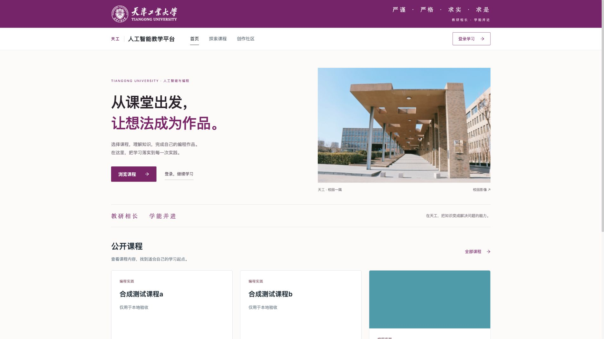
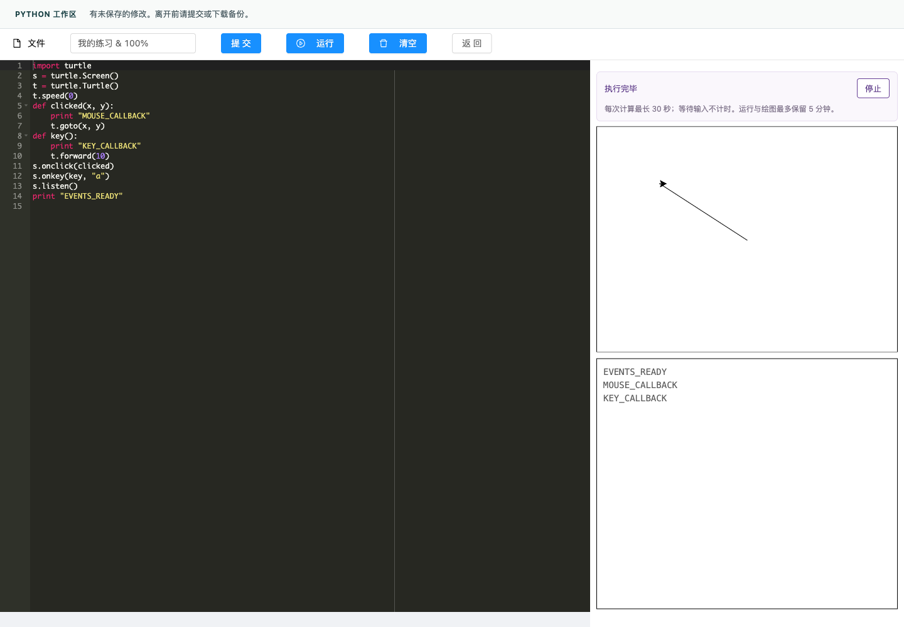
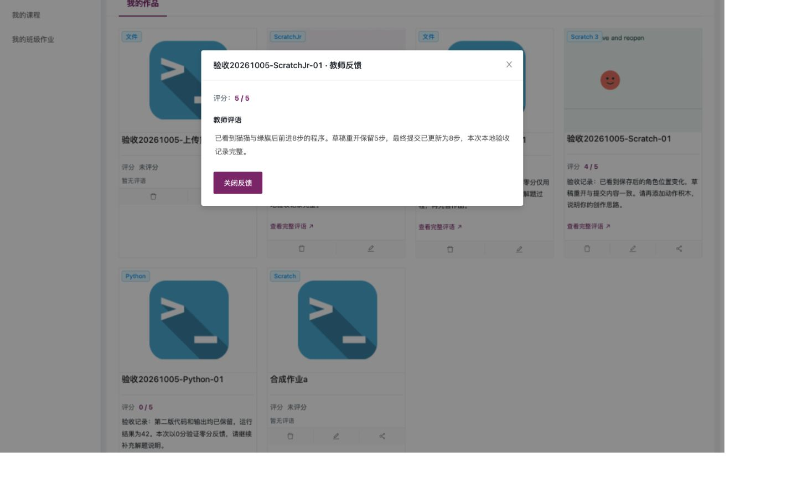
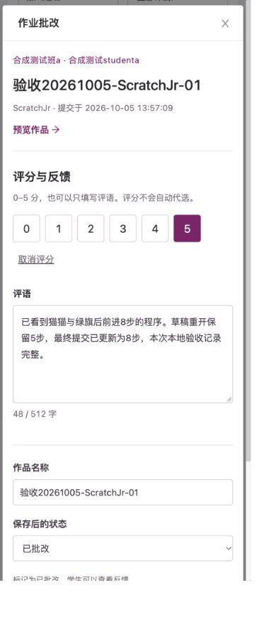
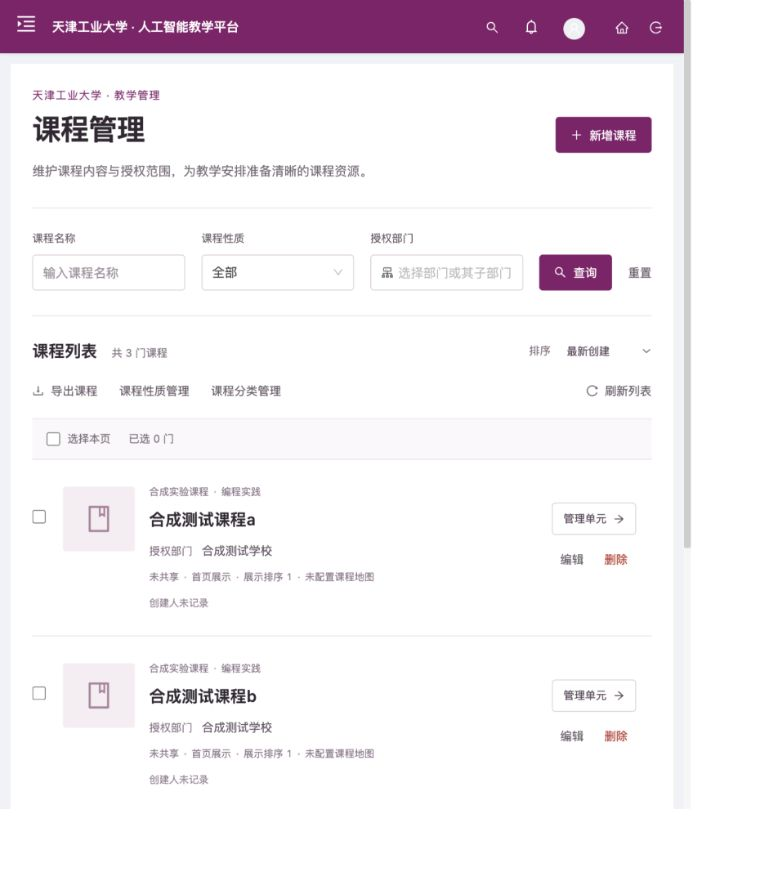

<div align="center">

# 天工 · TeachingOpen

**面向课堂的人工智能与编程教学平台**

学课程，做作品，让每一次实践都有反馈。

[项目亮点](#项目亮点) · [界面预览](#界面预览) · [本地体验](#本地体验) · [开发文档](#开发文档)

</div>

天工将课程学习、在线编程、作业提交与教师反馈连接在一起。学生可以从课程进入 Python、Scratch 或 ScratchJr 创作，教师按班级查看作品、评分并给出建议，管理员统一维护课程、账号与班级。

项目基于 TeachingOpen 持续开发，采用天工紫与天津工业大学校园视觉，服务于人工智能科普与编程教学场景。



<p align="center"><sub>本地示例环境实拍 · 2026-10-10 · 课程为合成演示数据</sub></p>

## 项目亮点

| 从学习到反馈 | 在平台中完成什么 |
| --- | --- |
| **课程学习** | 浏览与筛选课程，按单元学习图文、视频和 PDF，获取课程资料。 |
| **在线创作** | 使用 Python / Turtle、Scratch 3、ScratchJr 进行编程实践，保存并重新打开作品。 |
| **作业与反馈** | 提交编程作品或文件作业；教师预览、评分与批改，学生查看评分和完整评语。 |
| **教学管理** | 按班级组织教学，维护课程、单元、用户和成员，在各自权限范围内处理教学数据。 |

一条典型的课堂路径：**选择课程 → 学习单元 → 编程创作 → 提交作业 → 阅读反馈 → 继续改进**。

课程入口、学习页面和教学工作台提供桌面与窄屏布局；加载、空列表和请求失败有对应提示，部分编辑与提交流程支持保留输入后重试。

## 界面预览

<table>
  <tr>
    <th width="50%">在线编程 · Python 与 Turtle</th>
    <th width="50%">作品反馈 · 评分与完整评语</th>
  </tr>
  <tr>
    <td valign="top"><a href="docs/images/python-workspace.png"></a></td>
    <td valign="top"><a href="docs/images/student-feedback.png"></a></td>
  </tr>
  <tr>
    <td>在浏览器中编写代码、运行程序，观察输出与绘图。</td>
    <td>在自己的作品中查看教师意见，为下一次修改找到方向。</td>
  </tr>
</table>

<details>
<summary>更多界面：教师批改与课程管理</summary>

<table>
  <tr>
    <th width="40%">教师批改</th>
    <th width="60%">课程管理</th>
  </tr>
  <tr>
    <td align="center" valign="top"><a href="docs/images/teacher-feedback.png"></a></td>
    <td valign="top"><a href="docs/images/course-management.png"></a></td>
  </tr>
</table>

</details>

点击图片可查看原图。以上均为本地运行的实际界面，使用示例课程、合成账号或自写程序；功能截图保留其拍摄版本，未展示真实师生数据。[截图来源与日期](docs/images/README.md)。

## 本地体验

在线试用：[天工教学平台](http://101.201.225.116/index)。当前使用 IP 与 HTTP，注册需填写手机号、姓名、学校和身份。

本机体验可按[本地开发与运行指南](docs/local-development.md)启动独立示例环境，分别使用学生、教师和管理员账号进入平台。

**完整集成版本统一从 `main` 获取。** 本次汇总保留各功能 PR 的历史，注册行为以当前手机号资料注册为准：

```sh
git clone --branch main https://github.com/ZZZZihan/TeachingOpen.git
cd TeachingOpen
```

完整运行需要前端、Java 后端、MySQL 和 Redis。开发指南包含工具准备、构建、示例数据初始化、启动与登录步骤；示例账号口令由本地初始化工具生成。

原生开发指南对应 macOS arm64 工具布局；Linux/arm64 的候选包运行方式见[容器运行说明](https://github.com/ZZZZihan/TeachingOpen/blob/main/deploy/CANDIDATE.md)。其他系统的工具路径和运行环境需要单独适配。

## 技术与兼容性

| 模块 | 主要技术 |
| --- | --- |
| 页面与交互 | Vue 2.7、Ant Design Vue、Vue Router、Vuex |
| 业务服务 | Java 8、Spring Boot 2.1、MyBatis-Plus |
| 数据与会话 | MySQL、Redis、Apache Shiro、JWT |
| 编程工具 | Scratch 3、ScratchJr、Skulpt / Turtle |
| 构建与运行 | Vue CLI、Maven、Nginx、Docker Compose 候选包 |

前端通过 HTTP API 访问后端；后端组织课程、班级、作品与资源权限，MySQL 保存业务数据，Redis 支持缓存和会话相关状态。

**Python 兼容性：** 当前浏览器编辑器使用 Skulpt 的 Python 2 语法环境，支持 Turtle 绘图，不等同于完整 Python 3 环境。当前 Python 保存同时提交作品；Scratch 与 ScratchJr 支持草稿保存后再提交。

## 开发文档

| 想了解什么 | 从这里开始 |
| --- | --- |
| 在本机运行项目 | [本地开发与运行指南](docs/local-development.md) |
| 前端安装与构建 | [前端构建说明](https://github.com/ZZZZihan/TeachingOpen/blob/main/web/BUILDING.md) |
| 后端与独立开发环境 | [后端运行说明](https://github.com/ZZZZihan/TeachingOpen/blob/main/api/BUILDING.md) |
| 候选包与容器运行 | [候选包说明](https://github.com/ZZZZihan/TeachingOpen/blob/main/deploy/CANDIDATE.md) |
| 已检查的教学流程 | [三角色流程记录](https://github.com/ZZZZihan/TeachingOpen/blob/205e1ca10d68b7341c9f23fec9ece379365f5f9a/docs/optimization/authenticated-role-flow-2026-10-05.md) |
| 问题反馈与开发进度 | [Issues](https://github.com/ZZZZihan/TeachingOpen/issues) · [Pull Requests](https://github.com/ZZZZihan/TeachingOpen/pulls) |

```text
api/       Java 后端、数据库材料与本地运行工具
web/       前端页面、组件与编程编辑器
deploy/    代理配置、候选包与容器运行工具
docs/      开发指南、界面截图与工程记录
```

当前项目持续维护中。已有本地工程记录覆盖三角色代表流程与三种编辑器；实际课堂试用和目标环境部署仍需各自核验。旧框架兼容约束、检查范围及构建告警保留在开发文档中。

## 来源与许可

本项目基于 [TeachingOpen](https://gitee.com/chengyu2333/teaching-open) 开源代码持续开发，保留上游来源与版权信息。仓库许可证为 [Apache License 2.0](LICENSE)，第三方组件遵循各自随附许可。校园标识与照片的来源见[校园视觉记录](https://github.com/ZZZZihan/TeachingOpen/blob/main/docs/optimization/tiangong-branding-pr.md)，相关素材权利归原权利人。
