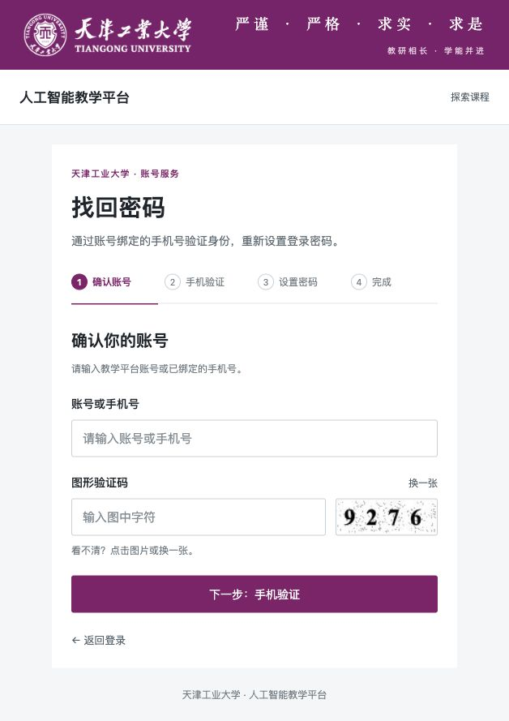
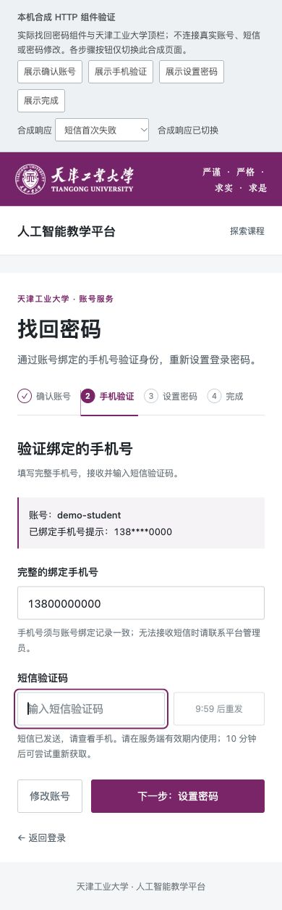

# 找回密码界面与流程修复

用户填写完整手机号后，原页面却把账号查询返回的脱敏手机号用于发送和校验；原修改密码请求还把密码放入 GET URL。本次让脱敏号码只作提示，三步请求使用真实输入，明确处理验证码有效、失败、已消费和修改结果不确定的不同状态。配合后端 [PR #69](https://github.com/ZZZZihan/TeachingOpen/pull/69) 切换，不单独上线旧后端。

## 界面与行为

沿用天津工业大学校徽/校名、校训和紫色主色，使用清晰的四步进度、可见字段标签、键盘焦点和行内错误。账号第一步保留真实图形验证码与账号查询，取消每键查账号；验证码加载失败有明确重试。手机号提示与完整输入分开，发送失败可立即重试，成功等待600秒再发。改密采用POST JSON，异步返回过期后不继续推进；新密码在完成、失败和离开时清除。结果不确定时说明可尝试新密码登录或重新验证，不误报密码一定没变。成功提供明确返回登录入口。

上图来自本机18142完整应用，匿名打开第一步，使用新候选dist与精确新JAR；没有提交验证码、输入新密码或修改私有副本账户。下图来自实际组件与UserLayout的本机合成HTTP夹具，仅说明手机布局和短信重试后的状态，不是短信实际送达或完整账号恢复证据。

## 验证与可复现对象

- 作者专项23/23、分支完整Node suite584/584；显式eslint --no-ignore检查七个产品文件零错误/警告。
- 独立审阅者编写的离线Vue状态/事件探针17/17；代码审阅未发现本范围blocker。这不代替DOM/网络验证。
- 根Agent实际CUA：合成HTTP页面的账号空值错误与焦点、完整手机号、短信失败后重试与十分钟倒计时、空新密码校验、完成入口、图形验证码图片失败及重试；代表状态测得390/768/1440宽度无页面横向溢出。未输入新密码、未完成图形验证码。
- 最终组合source `f92cc7dd5f960786aa3a698918d4db8d8d4a4fa6` 重新运行604/604，零失败零跳过；显式lint通过，构建成功。构建仍有12项CSS顺序和包大小警告，以及Browserslist数据库过期提示。
- 完整应用18142新首屏在实测CSS390/768/1440显示，图形验证码图片正常加载，无本次console error/warning。记录中保留初次尺寸测量不正确的截图，只有confirmed文件对应实测宽度；所有临时尺寸覆盖已清除。
- 4893个组合dist文件共211808928bytes，清单SHA-256 `a423e27e280dcbc18627c93e4707bf12e816a6324234717143587849d0bf624d`；三本地代理的首屏和构建资源原字节检查21/21。既有外部errlog脚本未由此探针请求。

七产品文件冻结于 `e326d175dec17002cfe2e90c779bc1952db3557e`；后续 `d8be5d7` 只修预览HTML相对script导致深链接空白，改绝对`/preview.js`并重建。预览source manifest SHA-256 `0707ccd4cd7e647b60dfe90260102b51bba5b25f144267ed88e1220c38cd4e66`保持一致；其初次console错误保留，重载后未再出现。此次交付提交只增说明、截图和无凭据的观测JSON，不再更改产品。

## 边界

父分支为 #63；必须配套 #69，旧GET改密与缺少username的旧恢复请求不兼容。本轮未进行真实短信送达、完整浏览器改密、人工视觉验收、生产部署。后端的合成实际接口22/22、登录7/7和角色缓存11/11归属根Agent，并不等于独立API专项；后者被平台风险检查中断仍未完成。私有生产来源副本仅匿名只读核验12/12，选定七张业务表在服务切换和检查前后摘要不变。两个PR仅供审阅，未远端合并。

作者细节见[实现记录](account-recovery-ui-agent-notes.md)。原始日志、完整截图、合成数据与冻结产物留在项目私有`.devspace/artifacts/account-recovery-20261005/`，不提交真实课程内容或凭据。
