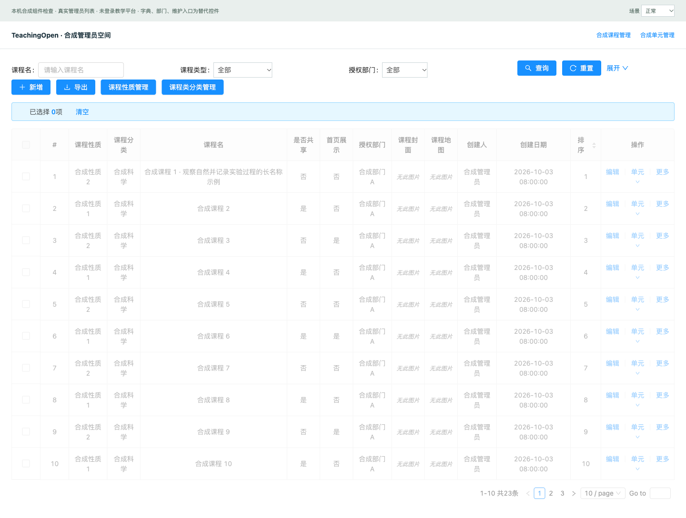
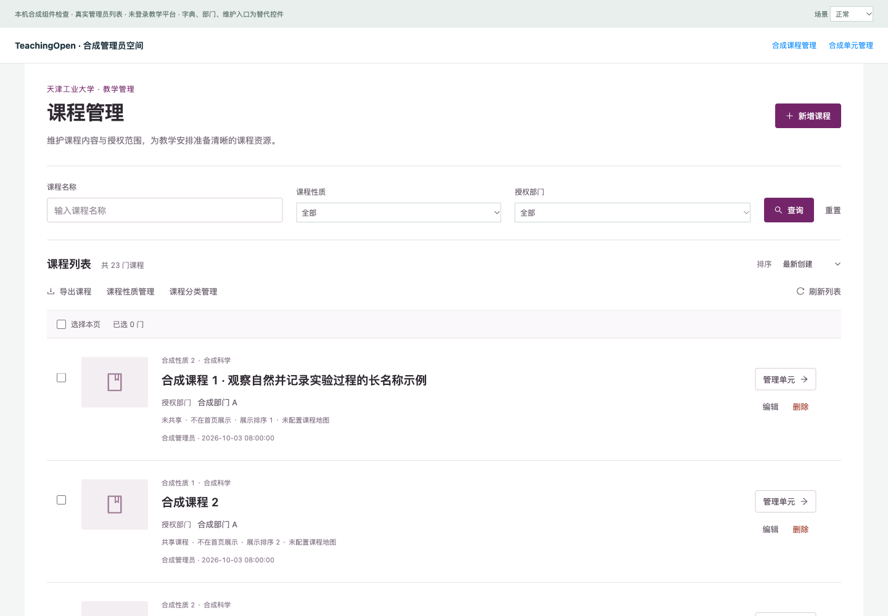
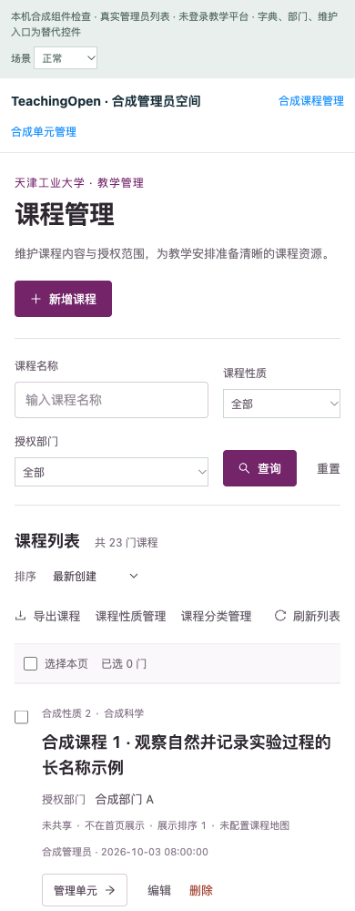
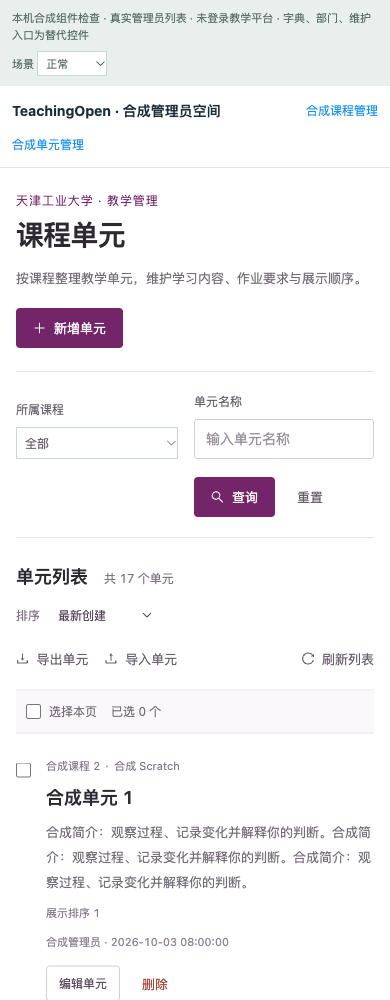

# 管理员课程工作台与可恢复维护操作

日期：2026-10-03。产品提交 `c5eb0042f5103bc7829c1f9fb48a13aa2c881ae2`；基于 PR #42（`fix/course-form-recovery`）。真实 API 检查使用 PR #43 Java 构建，前端源码不依赖新的后端字段。

## 问题和结果

原管理员课程/单元页在窄屏中列宽拥挤，课程信息与操作不易辨认；修改搜索输入后翻页会使用未提交条件，旧请求能覆盖新查询，失败时旧行仍留在页面，连续删除可以重复发请求。两页现改为白底行列表、工大紫色及清晰的信息层级，保留已有维护入口、真实字段和分页能力。

查询提交后保存条件，翻页、排序、刷新、导出使用这份条件；请求序号排除晚返回数据。失败显示可重试状态，删除操作互斥、末页删除后回到有效页。查询、课程路由或选择变化后，旧批删确认失效。导出拒绝将接口 JSON 错误下载成 Excel。未分配部门与共享状态分别显示，不推断访问权限。原有新增/编辑表单、字典管理、单元维护及导入导出继续调用原入口。

没有修改后台权限、表结构、共享 mixin 或依赖。整体采用现有学校配色；没有新增伪造校徽、校方认证或统计数字。

## 验证及证据范围

| 检查 | 结果 | 范围 |
| --- | --- | --- |
| 最终完整前端脚本测试 | 279/279 | UI Agent 执行，包含下列 57 项 |
| 本次列表脚本与共享 mixin | 57/57 | 测试 Agent 编写并执行；9 项旧行为复现、48 项候选检查 |
| 实际 Vue/Ant 合成浏览器 | 62/62，无意外渲染错误 | 最后批删 guard 修改之前；两页 1440/768/390、操作及异常状态 |
| 最终批删 guard 实际 DOM 复验 | 4/4，无异常 | 最终源文件，切换课程后旧确认发 0 DELETE |
| 真实隔离 Java/MySQL API | 37/37 | root 执行；父课程名称、完整编辑字段、false/0、排序、分页、过滤、权限、OLE2 导出签名及删后 total |
| 最终前端构建、两列表显式 ESLint、diff 检查 | 退出 0 | 构建有 12 项 CSS 顺序/体积告警和 Browserslist 数据过期提示 |

各层不合并为一个总通过数。真实 API 使用 JAR SHA-256 `c2898fa71e75294fe03bc1401388a7c50126c2964030c3739dd949c840a9a364`；临时课程/单元清理后，68 张非审计表和附件与执行前一致。root 查看了桌面及手机截图并审查最终 diff；它是本次工作的复核，不是用户验收。

[汇总 JSON](evidence/admin-course-workbench/admin-course-test-summary.json)、[实际 API 结果](evidence/admin-course-workbench/admin-course-actual-api.json)、[UI Agent 记录](admin-course-ui-agent-notes.md)、[测试 Agent 记录](admin-course-tests-agent-notes.md) 包含命令、源文件哈希、失败与重试。初次 Ant Tooltip 渲染错误、旧批删确认竞态以及测试定位失败均保留，未计入通过数。

## 界面证据

桌面课程列表修改前：

桌面课程列表修改后：

手机课程列表及单元列表：

其余两页三尺寸及加载/错误/空态/删除失败共 23 张截图见同一证据目录。截图内容为明确标注的合成数据，没有生产账号或作业。

## 待验收与边界

浏览器加载实际列表、Vue、Ant 和原 mixin，但 API、字典/部门控件、维护弹窗入口使用合成替代。没有通过验证码、注入真实 token 或使用生产登录。真实字典/部门选择、完整管理员登录维护链路、Excel 内容及导入事务、生产副本内容兼容仍待各自验收，因此 PR 保持 Draft。已有表单检查属于 PR #42，不能当成本 PR 的整链路浏览器验收。

按用户要求，代码与测试分别由 GPT-6.1-sol / Ultra 子 Agent 并行完成，root 负责真实 API、最终审查、记录及 PR。工具没有 Fast 参数，不声称启用。提交、推送和本地候选组合不等于 GitHub 合并或生产部署。

交付整理：可提交文本日志去除了行尾空白，原始日志保留在本机私有目录；未改变结果内容。一次推送误选上游 `origin`（Gitee）因无登录凭据失败，随后使用本项目私有 GitHub remote；上游未发生变更。
