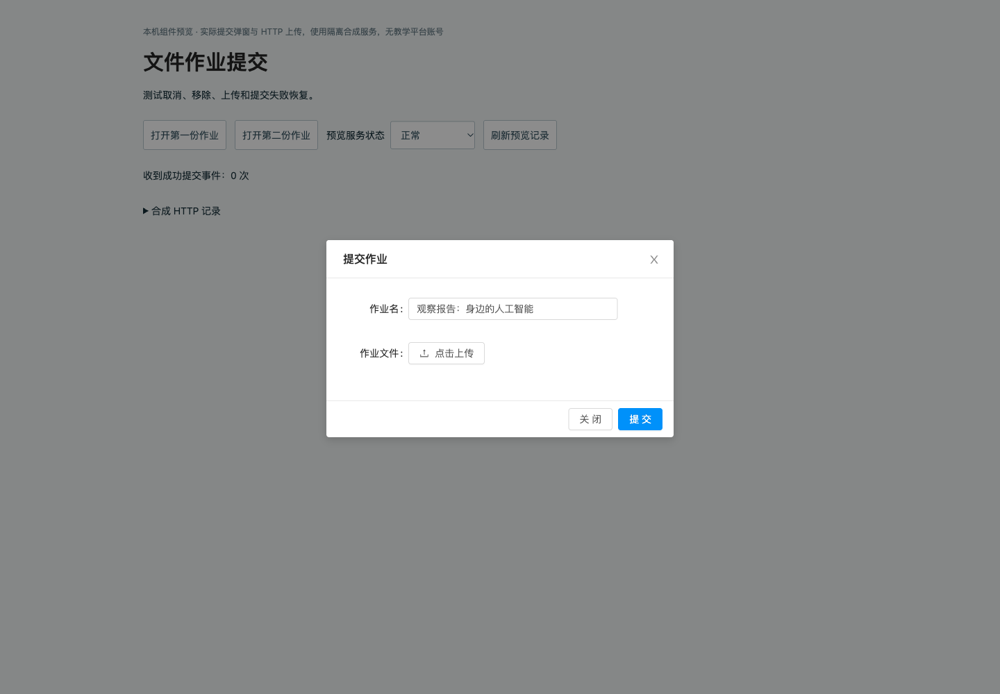
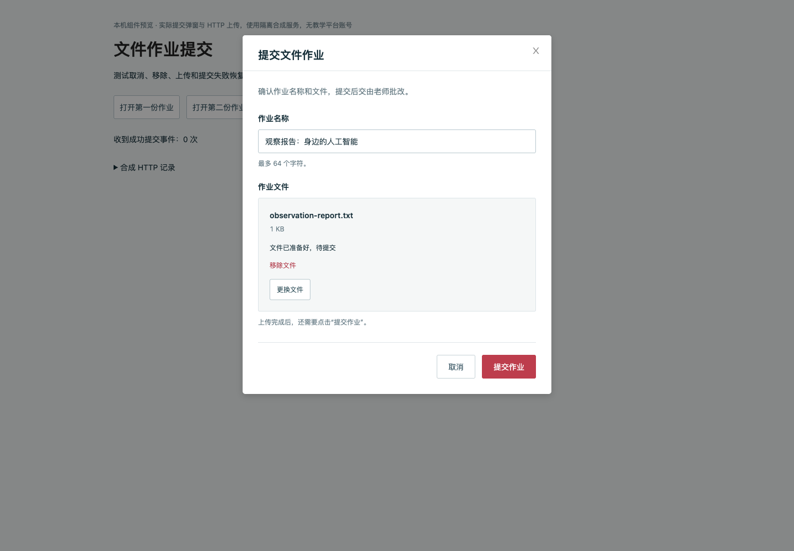
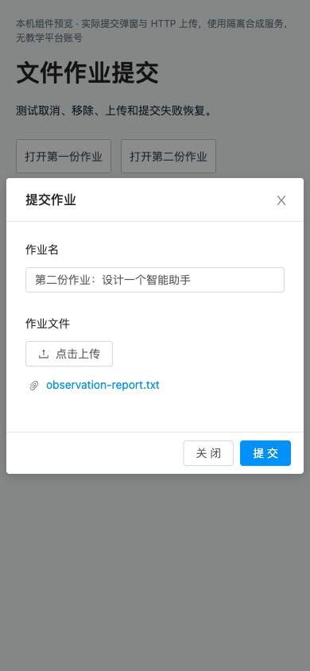
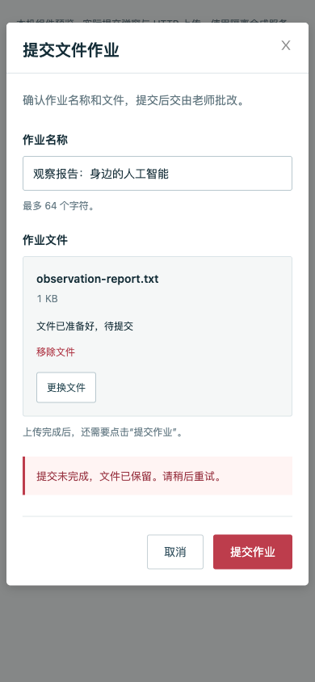

# 文件作业提交与失败恢复

旧弹窗在作业 A 上传文件、取消、再打开作业 B 后，仍把 A 的文件 ID 发给 B。旧上传器删除文件也没有同步清除弹窗里的 ID。实际浏览器已复现跨作业提交请求，见 [旧 HTTP 记录](evidence/assignment-file-submit/before-http.json)。

新弹窗每次打开都初始化文件状态，只接收当前作业所需字段。文件传输和文件登记都成功后才能提交；取消、移除或销毁会取消上传并忽略迟到响应。提交期间锁定重复操作；业务失败保留文件，网络失败说明结果尚未确认。成功后发出事件刷新父作业列表，列表失败能退出加载并重试。

表单采用与学习页一致的墨色文字、白底和红色主操作，显示名称长度、文件大小、上传阶段、错误和下一步。单文件非空且不超过 10 MB；名称为 1–64 字符，沿用后端约束。没有新增依赖，也没有修改通用 JUpload 或后端。

## 准确候选与依赖

- 产品与测试提交：`c532e52f7c5c1c5bc80f912c62eccb40b96451c7`。
- 前端 base：PR #22 `1bd5fecc9f634612cca7180d7211148ecb8ea1dd`；浏览器旧行为取自本地组合 `78f8b350f150422dbdbdd59488523a9e33295cd5`，包含旧弹窗及 #14 的 `workStatus: 1`。
- 后端依赖 PR #20 的链路，包含 #14 的提交契约和 #17 的文件登记/七牛前缀契约。不能把此分支旧 API 树直接当作部署后端。
- 精确源码、构建及证据摘要见 [candidate.json](evidence/assignment-file-submit/candidate.json)。

## 自检与浏览器观察

`npm test` 为 95/95，其中本次 13 项；三个改动源文件 ESLint 为 0 错误、0 警告；生产构建成功，仍有 6 条已有的 CSS 顺序和资源体积警告。单元检查涵盖取消/移除/迟到响应、文件与名称限制、上传和登记失败、提交失败与单次请求、父列表恢复，以及受控七牛凭证/key/认证隔离。

浏览器使用实际 Vue 弹窗、Ant Design 和上传适配器，通过真实 HTTP 连接仅监听本机的合成服务。上传材料是仓库自制文本；无平台账号、认证绕过或真实教学数据。观察到：

- 旧弹窗取消后将 A 文件提交到 B；新版同样操作和移除已上传文件均没有发出提交。
- 登记失败显示错误并保留重试入口，恢复服务后同一选择可重新上传并就绪。
- 提交失败保留已登记文件；重试成功复用同一 ID，成功事件一次。
- 慢速提交中提交/取消/换文件/移除被锁定，关闭按钮隐藏；一次成功请求。
- 慢速上传中移除文件，迟到响应不会恢复文件，也没有后续登记或作业 B 提交。
- 390、768、1440 宽下页面和弹窗无横向溢出；最终浏览器 error/warn 记录为空。

| 旧版 | 新版 |
| --- | --- |
|  |  |
|  |  |

另见 [平板截图](evidence/assignment-file-submit/after-ready-768.png)、[手机就绪](evidence/assignment-file-submit/after-ready-390.png)、[几何记录](evidence/assignment-file-submit/responsive-geometry.json) 和 [恢复 HTTP 记录](evidence/assignment-file-submit/after-recovery-http.json)。

## 复现方式与边界

在 `web/` 使用现有锁定依赖运行：

```sh
npm test
npx eslint --no-ignore src/views/teaching/modules/TeachingWorkSubmitModal.vue src/views/teaching/modules/assignmentFileUpload.js src/views/account/course/MyAdditionalWorkList.vue
npm run build
node tests/assignment-preview/build.cjs /tmp/assignment-preview
python3 tests/assignment-preview/server.py --port 18116 --directory /tmp/assignment-preview
```

本机访问 `http://127.0.0.1:18116/`。选择预览故障模式、打开两份作业，使用 `tests/assignment-preview/assets/` 自制文件操作。比较旧组件时给构建命令追加旧提交 SHA；合成服务只在内存记录文件名、大小、摘要及请求，不持久化附件或作业。生产包不包含测试外壳或 API 替身。

取消/移除只清除选择和取消等待，**不删除已传输或已登记的文件**，未实现孤立附件回收。请求结果未知时，服务可能已接受提交；前端防重复不等于服务端严格一次写入。七牛仅受控检查，未连接真实云存储。父列表刷新为组件/契约检查，尚非实际父页面浏览器验收；Scratch、ScratchJr、Python 保存重开提交也不在本次范围。

真实认证后端的完整上传、持久化、列表刷新和角色闭环仍待验收，PR 保持 Draft。原源码 5,634 项摘要未变；三个既有后端健康 UP。旧版比较服务 18117 已停止、浏览器尺寸恢复，18116 保留本机预览。未合并 GitHub PR，未部署或修改生产。
