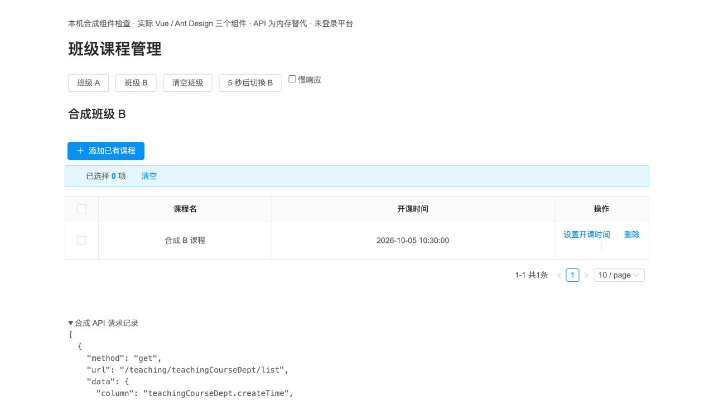

# 班级课程操作绑定当前班级

管理员在 A 班勾选课程关系后切换到 B 班，旧代码仍可能向后端提交 A 班关系 ID 并删除 A 班关系；课程选择弹窗也会保留旧选项，并用当前 B 班 ID 添加。旧确认框、迟到列表响应和共享开课时间弹窗均未绑定一次班级操作上下文。

产品提交 `b940c8c5b20694e76bf15c481dc72c2a6864d476`，基于 PR #59 `253f3fb4c44b500b6e4824adbf89da51ac89d50c`。三份产品 SFC 为 `DeptCourseInfo.vue`、`SelectCourseModal.vue` 和 `TeachingCourseDeptModal.vue`。实现与两组独立测试分别交由用户指定的 GPT-6.1-sol / ultra 子 Agent，根代理审查、运行真实组件预览并整合交付；子 Agent 工具没有单独 Fast 参数。本轮未改共享列表 mixin、角色权限、后端产品源码、依赖或数据库结构。

切班、清空或同班重开会建立新上下文，清选择、列表和分页，并关闭旧选择/编辑弹窗。读响应和已发写响应只更新仍匹配的界面；删除确认保存原班级、选择和关系快照，确认失效或重复提交时不发送请求。课程选择事件携带原班级与版本，父组件验证后才提交。共享时间编辑只提交已注册的 `openTime`，关系身份来自打开时模型，普通独立编辑入口仍保持原事件契约。失败保留可重试状态。

分页、搜索、刷新和重试后需要在当前结果中重新勾选；本次不提供跨页保留选择。已经发往服务器的合法写请求仍可完成，本次保护的是其原目标及后续界面，不提供取消服务端写入的承诺。

## 验证

最终独立离线专项 61/61，同一组断言在精确旧基线上为 7/61；完整分支前端 497/497。初轮 43/44、扩展初轮 48/53 及后续调整均保留，不将中途发现的失败追记为通过。方法测试使用实际 SFC / mixin，受控请求、确认和表单；真实 Antd 控件另由根代理检查。详见 [独立测试记录](class-course-context-tests.md)。

独立实际 HTTP / MySQL 对照使用同一组最终行为判据和冻结 PR58 后端包：旧前端 **8/20**，新前端 **20/20**。旧版两种批删操作各实际发送一个 DELETE 并删除 A 班关系；两种旧弹窗操作各发送一个 POST，将旧选择加入 B 班。新版四种场景均没有写请求，数据库状态保持；正常 B 班查询、添加、开课时间修改和删除继续通过。三个 SFC 运行摘要与作者冻结值完全匹配。两轮分别核对 69 个表结构、68 个非审计表完整行及附件均恢复。表单、确认和 nextTick 为方法夹具，HTTP 与数据库为真实本机服务，不能称为认证浏览器验收。

初始化曾因夹具课程名 33 字超出现有 varchar(32) 失败，未进入产品方法运行；临时记录在 finally 清理，保留初始化失败 JSON，该首轮没有完整前后清单，不能追认其已通过完整恢复检查。缩短合成名称后旧新两轮均完成完整恢复检查。通用 seed 的两个合成班级 org_category 原为 2，本专项临时设为真实面板所需 3，结束逐列恢复原用户、部门行；没有修改生产身份或记录。

根代理用实际 Vue、Ant Design、JDate 及三个产品 SFC 构建浏览器组件预览，仅将 API 替换为内存夹具。观察到 A 勾选→B 选择清空；A 行删除确认在 B 点击确认无 DELETE；B 正常添加、时间编辑和批量删除。首轮真实浏览器暴露动态 `getCheckboxProps` 缓存禁用状态，已移除该动态属性，保留加载遮罩和方法检查。后续发现未注册身份字段回填的两条旧告警，最终仅回填时间字段；最终真实日期修改到 `2026-10-05 10:30:00` 后列表回显、弹窗关闭、关系身份不变，当前回合 error / warn 为空。

前两个 SFC 在第二轮和最终轮摘要相同；最终轮只改共享表单，已重新编译并复验该路径。首轮禁用截图、旧告警、各阶段 DOM 和源码清单均保留在 [证据目录](evidence/class-course-context/)。该预览无平台登录、真实后端或数据库，不等同完整管理员入口验收。

## 组合与复现

本地组合产品提交 `bf69b28f859d70ed5f39b4712c96244a94a20c66` 构建成功，沿用既有 Node/npm 和依赖目录，保留 12 条既有 CSS 顺序/体积告警。4893 个产物共 211494174 字节，新增/重命名 14 个文件并移除相应旧哈希文件；前端 manifest SHA-256 为 `8d8dd1a02a14f15aa2c744b0e5a16ac28da9e7929096e27faa068a6ae7e4575e`。三个本机代理各 16 项初始资源和变更页面脚本实际 GET 共 48/48 逐字匹配，三个原后端健康均为 200 UP，冻结 PR58 JAR 保持原用法。完整上一版 4893 文件保存在本机私有 artifact 中，可回退。

加入冻结专项测试后的组合提交 `230eb19b11baaccc1ef8470fc8afe6f3aac004c4` 再执行完整前端 **517/517**，0 失败、0 跳过，记录为 [组合测试日志](evidence/class-course-context/integration-tests.log)。测试整合没有改变三份产品源码或已验证的构建文件。

离线入口为 `web/tests/class-course-context.test.cjs`；完整前端为 `npm test`。当前工作树沿用组合的已有依赖，可显式设置 `NODE_PATH` 指向 `product-candidate/web/node_modules`。组件预览执行 `NODE_OPTIONS=--openssl-legacy-provider node tests/class-course-context-preview/build.cjs OUTPUT`，再以 loopback 静态服务器提供 OUTPUT；浏览器动作和观察记录见证据目录。该工具不会代理真实 API。

HTTP 入口为 `api/dev/verify-class-course-context.py` 与 `web/tests/class-course-context-live.cjs`，使用 PR58 的 `api/dev` 工具（`PYTHONPATH` 指向 `encoded-media-references/api/dev`）和冻结包 SHA-256 `4578567dcedc18bf8a5f69758f8209d9b7bc74fc24f24f0d50196ec97e684c42`。脚本仅接受 `.devspace/class-course-context-1003` 和端口 13371/16444/18175/18176，拒绝已有输出和其他旧源码 ref；传入 runtime、jar、source、output，旧版另传 `--ref 253f3fb4c44b500b6e4824adbf89da51ac89d50c`。合成 CLI 认证凭据只经 stdin 传入 Node，不发布到证据或浏览器。

生产内容副本仍是 `.devspace/prod-fixture-1003`，保留真实课程/媒体用于兼容性检查；身份字段已替换但正文媒体不是完全匿名内容，继续私有。本轮写入对照使用独立合成 runtime。完整认证三角色流程、用户视觉评阅和生产交付仍分别待处理。没有 GitHub 合并或生产变更。

实现细节见 [作者记录](class-course-context-author.md)，实际 HTTP 与环境关闭情况见 [运行记录](class-course-context-live-tests.md)。
