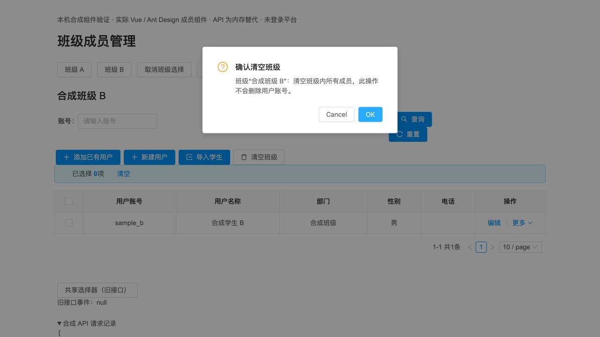

# 班级成员操作绑定原班级与弹窗会话

管理员在 A 班打开“清空班级”确认后切换 B 班，再点确认，旧页面会实际清空 B 班；旧成员选择、列表响应、用户编辑和角色弹窗也可能带入新班级。另一个同范围问题是：部门角色接口返回用户全部班级角色，旧页面在 A 班保存时会把不可见的 B 班角色一并删除。

本次将四个共享组件的读写与打开时的班级、选择和弹窗会话绑定。切班、清空选择或同班重开会清除旧选择并关闭旧窗口；未发送的旧确认、选择器回调、表单验证与导入被拒绝；迟到响应不能覆盖新界面。确认提示显示目标班级，失败保留反馈和可重试状态。部门角色的 old/new 集合只包含当前可配置范围，保留其他班级角色。正常当前班级操作及共享组件普通调用保持原契约。

产品及冻结方法测试提交 `57bf493`，基于 PR #60 `8f58b32362899047da0136e41278368fd26c88f0`，分支 `fix/class-member-context`。四份产品 SFC 为 DeptUserInfo、SelectUserModal、UserModal、DeptRoleUserModal。实现与两组独立测试分别交由用户指定的 GPT-6.1-sol / ultra 子 Agent；根代理审查、操作实际组件预览、集成构建并交付。工具没有单独 Fast 参数。没有修改全站 mixin、后端产品源码、依赖或数据库结构。

选择限定当前结果，翻页、查询或刷新后需重新勾选。已经送达服务器的合法写请求仍可完成；本次保持其原目标并隔离后续 UI，不承诺撤销服务器写入。用户编辑等待角色与部门完整读取，编辑时保留用户实际全部部门关联；在班级入口新建则固定原班级。

## 验证结果

独立离线专项使用实际 SFC/mixin，冻结同一组断言：旧版 **13/64**，候选 **64/64**；相邻 **176/176**、分支完整前端 **561/561**。受控 API、表单验证、确认、nextTick 和上传 transport 不等同实际控件与数据库。早期尚未完成的产品版本、夹具接口适配失败及旧版失败 TAP 均保留，详见 [独立方法测试](class-member-context-tests.md)。

实际 HTTP/MySQL 使用独占合成 runtime 和冻结 PR58 后端包：成员专项旧 **12/22**、新 **22/22**；角色专项同一最终工具旧 **7/9**、新 **9/9**。旧清空确认确实删除 B 关联；旧 selector 确实把旧用户加入 B。新版失效操作不发写请求，正常添加、单取消、批取消及清空保留。角色保存的 DB 回查：A 取消后 Aold=0、Anew=0、Bold=1；A 添加后 Aold=0、Anew=1、Bold=1。旧版两次 Bold 都变成 0。

角色候选首轮 **8/9** 原样保留：夹具按照旧版会删 B 的假设，无条件重新添加新版已经保留的 B 角色，产生重复关联。改为仅在 B 不存在时恢复夹具后，旧版和新版均用相同工具重新运行，没有改产品或放宽断言。全部完成的对照核对 69 个表结构、68 个非审计表完整行和附件恢复一致；账号原值只在私有 runtime 保存，不进入仓库。实际服务结果见 [HTTP 与恢复记录](class-member-context-live-tests.md)。

根代理在真实 Vue/Antd 中复现旧版清空 B，并验证新版旧确认不写入、B 正常添加和取消关联、旧接口 selector 仍发数组。最终四源码 hash 重新编译后，普通用户编辑提交原用户与班级、A 编辑中切 B 关闭旧抽屉、B 部门角色正常保存均通过，error/warn 为空。API 是内存合成替代，位置、部门和头像子选择器被替换；用户编辑只证明真实表单参数、成功关闭及刷新，内存 API 不持久化姓名。这不是平台认证全流程。各阶段源码摘要与 DOM 见 [浏览器记录](evidence/class-member-context/root-browser-final.json)。

390、768、1440 CSS 像素均保存截图。390 下 document scrollWidth=411、body=412，旧版与新版相同；768/1440 没有横向溢出。该旧窄屏问题保留为独立 UI 待办，没有宣称本次全响应式通过。初轮预览使用较早的共享抽屉源码，最终冻结后已重编并复验其编辑与角色路径；之前的原始记录仍保留。

## 组合、构建与恢复

本地组合 `3a18de7854b2b96b22f6f71a658cac9aeeb075f4` 完整前端 **581/581**，0 失败、0 跳过；构建退出 0，保留 12 条既有 CSS 顺序/体积告警。4893 个产物共 211568970 字节，manifest SHA-256 `9d7589a49ebfceced30d3daf452f13094727bf160c04ff84295c09030c9c3005`。新增或变化 31 个文件，移除对应旧哈希文件 30 个。三个本机代理的初始资源及变化 JS/CSS 各 26 项，共 **78/78** 实际 GET 字节相同；三个原后端均 HTTP200 UP，仍使用冻结 PR58 JAR `4578567dcedc18bf8a5f69758f8209d9b7bc74fc24f24f0d50196ec97e684c42`。

上一版本 dist 的 4893 文件、211494174 字节已完整复制并逐字核对，保留在本机私有 artifact 的 previous-dist，可回退。记录与测试工具的后续提交不改变已测四产品源码或构建产物。根预览 18180 已关闭并确认进程退出，独立 runtime 的停止证据与目录保留状态见 HTTP 记录。常用 18112/18142/18150 继续服务新前端；18150 登录入口刷新正常，验证码未操作。

## 复现与剩余问题

在 web 下运行 `node --test tests/class-member-context.test.cjs` 和 `npm test`；旧基线设置 `SOURCE_REF=8f58b32362899047da0136e41278368fd26c88f0`。组件预览运行 `NODE_OPTIONS=--openssl-legacy-provider node tests/class-member-context-preview/build.cjs OUTPUT`，将 OUTPUT 通过 loopback 静态服务器提供；它不连接真实 API。已有依赖可经 NODE_PATH 指定，无新增安装。

实际服务工具是 `api/dev/class-member-context-live.py`、`api/dev/class-member-role-live.py` 及对应的 web/tests/*.cjs；只接受本专项隔离路径和冻结 JAR，使用 PR58 的 dev 模块，具体调用与最终 probe 摘要见 HTTP 记录。认证通过正常 CLI API，凭据和 token 不记录或注入浏览器。

**另行确认但未在本 PR 修复的后端权限问题：** 合成学生通过合法登录直接请求现有 removeAll 接口，可清空合成班级成员，账号仍保留。该事实在独立 runtime 实际复现并恢复；前端上下文校验不能替代后端授权。该问题作为下一独立后端 PR 的优先项，不能把本次测试全绿解释为接口安全已完成。

Z820 的真实课程/媒体副本继续在私有隔离环境使用；本轮破坏性写入检查使用合成库，没有写生产或修改真实课程内容。完整认证三角色浏览器流程、用户视觉评阅、旧窄屏问题和受支持平台维护仍待处理。没有 GitHub 合并或生产部署，产品化 Goal 继续 active。实现契约与冻结摘要见 [作者记录](class-member-context-author.md)。
