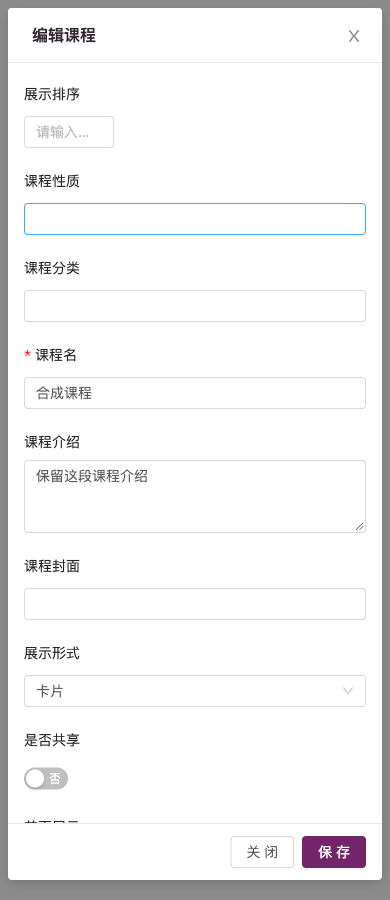
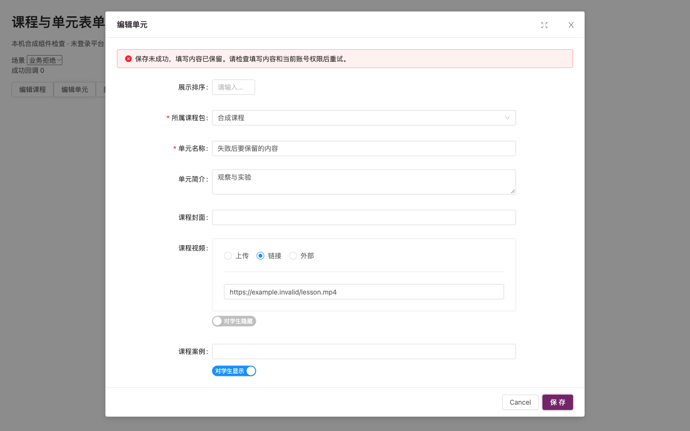

# 课程与单元表单保存恢复

管理员保存课程或单元时，旧表单在 `finally` 中无条件关闭。业务拒绝会丢失填写现场；连续触发校验还会发送重复请求。产品提交 `14430e1` 修复两个表单的同一问题，基于 #41 `feature/teacher-workbench`，运行契约使用 #40 精确 JAR。

现在仅明确 `success === true` 才提示成功、关闭并通知父列表刷新。业务失败、网络失败和畸形响应保留输入与开关，错误在表单内显示并获得焦点；不回显后端内部错误。网络失败提示核对列表后决定重试，避免将响应丢失误判为未创建。没有自动重试或服务端幂等保证。

校验开始即锁定，防止异步校验/重复点击产生并行写入；保存时锁定关闭、Escape、取消和正文交互。干净表单可直接关闭，修改后的表单需选择继续编辑或放弃；迟到校验/保存/填充不影响新打开或已销毁的表单。构造新的请求对象，不把提交值直接写回原 model。去掉原先的整份表单控制台日志。

保留字段、接口、权限、地图/上传入口和原有两种弹窗。新增局部滚动正文、可见页脚和视口宽度限制，按钮使用天工紫。两个已有 Vue 文件按当前 ESLint 自动格式化；未进行管理页面整体重构。

## 验证

- `cd web && npm test`：222/222，其中本项新增 20 项实际组件方法检查，包括两项旧版本缺陷复现。
- 三个改动 JS/Vue 文件显式 `eslint --no-ignore`：0 errors / 0 warnings。
- `npm run build`：成功；6 组已有 webpack 提示和 Browserslist 数据库过期提示保留。
- [Chromium 30/30](evidence/course-form-recovery/browser.json)：旧版拒绝后实际关闭、新版业务和网络失败保留、错误聚焦、慢请求仅一次写入/一次回调、Escape/关闭锁定、继续编辑/放弃/干净关闭。两个表单均检查 390、768、1440 宽度，保存按钮可见且弹窗没有横向溢出；14 张前后/错误截图在同目录。
- [真实 Java/MySQL 24/24](evidence/course-form-recovery/actual-backend.json)：合成管理员新增、修改、重读、正常删除课程/单元，保留 false 开关、0 排序及内容；教师、学生、匿名修改拒绝且原行不变。精确 JAR SHA-256 `d89ef0667d90854195792b30d2af4b469738bb86c65498bd7c68ce350aeb3ac8`，没有修改后端。结束后 68 个非审计表与附件摘要恢复一致，sys_log 正常产生认证审计。
- 主源码 Git 跟踪及非忽略文件 5,731 项摘要仍与保护清单相同。

浏览器使用真实课程/单元组件、Ant Design 表单和 JModal，HTTP 响应为本机合成；上传、富文本、字典、部门、地图为替代控件。真实后端检查在独立 CLI 完成，没有注入浏览器凭证或绕过前序验证码操作确认。两类证据分别成立，不能合称真实登录管理员端到端通过；复杂控件全流程、用户审美和完整管理页面继续待验。

## 截图

课程手机宽度，正文可滚动且保存按钮可见：

单元业务拒绝后保留输入：

## 复现工具

`web/tests/course-form-preview/build.cjs OUT [BEFORE_REF]` 构建组件夹具；`server.py --directory OUT --port PORT` 仅监听 127.0.0.1。before 使用 `2a530a517d9eaaea5b4aa53a2f494edf521e4996`；after 使用当前源。`verify-browser.js` 由 Playwright CLI `run-code` 在端口 18135/18136 执行，截图放在 output/playwright。实际 API 检查用同目录 `verify_backend.py`，要求 `--support-repo`（当前完整后端源码）、`--runtime`、`--jar`、新的 `--output`，内置精确 JAR 和合成环境保护。不会启动生产服务。

首次组件测试把单元名称错写成课程名称，修正测试字段后 20/20。首次预览构建引入 utils/util 的整站依赖，改为仅替代无关 resize 工具，真实 JModal 保留。第一次后端检查用字符串期望 Integer 作业类型，校对 Java 类型后按数值重跑 24/24，失败时清理已通过。第一次浏览器截图早于入场动画完成、单元成功回调观察过早；补上动画完成和回调渲染等待后完整 30/30。上述失败日志保留在私有 .devspace，不计作通过；控制台存在预期合成 503、favicon 404 及旧 Ant Design 表单警告，未声称零控制台错误。

## 限制与后续

真实 API 另外确认：对不存在 ID 的课程、单元执行 edit，HTTP 200 / success true，但数据库不存在该行。该独立后端问题保留为下一项待修复，不能由本项表单识别。原表单的并发编辑覆盖、课程下拉固定 999 条、地图/上传操作及服务端幂等也未因此完成。刷新整个页面仍会丢失未保存输入，没有引入本地长期存储。

本 PR 不改数据库结构和数据，也不增加依赖；可撤回本分支的产品提交恢复原表单。交付仅为私有 PR 与本地候选，不自动合并或上线。
