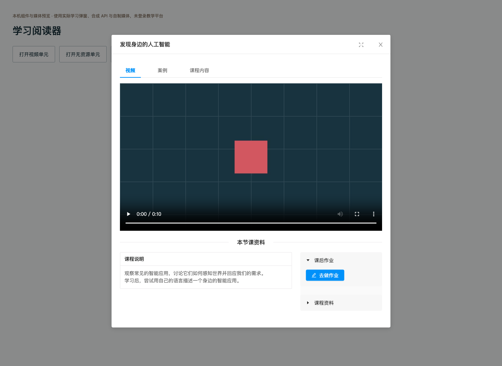
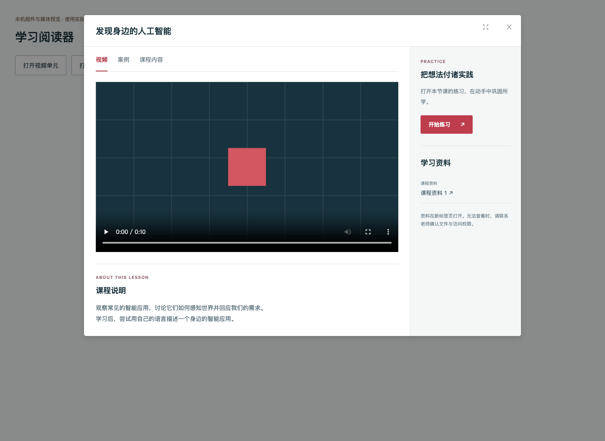
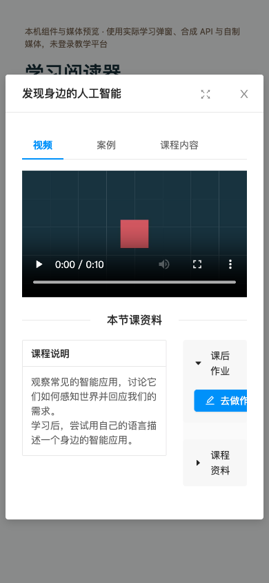
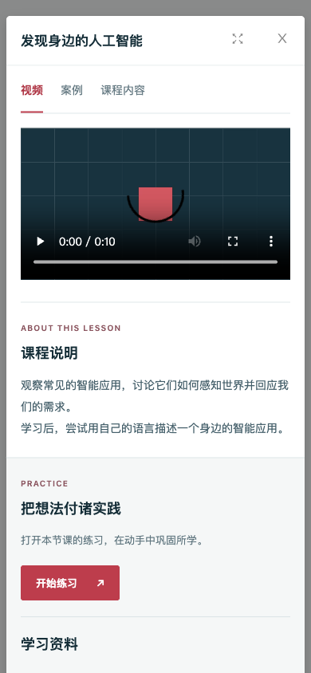
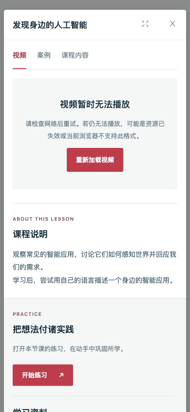

# 学习阅读器、媒体恢复与案例尺寸适配

基于 PR #21 `8d3a3fe`，产品代码 `418028107176889a89c6c0ea1459949808c56050`。本项只交付课程单元阅读体验及其必要的媒体兼容修复；没有后端、权限扩大或依赖升级。

旧弹窗在窄屏仍将课程说明与作业并排，按钮文字被裁切；播放资源缺少明确失败恢复。新弹窗以内容为主区，资料和练习为侧栏，手机宽度改为上下排列。沿用公共页面的深青文字、珊瑚红操作色和细边框。视频、案例、文字按真实资料显示，空单元明确说明缺少内容，不生成虚假进度。

视频错误可点击重试；切换、关闭、缓存停用与销毁都释放媒体并移除监听器。日志失败只提示记录未同步，不阻断课程阅读，旧单元请求不能污染新单元。实际 Scratch 案例发现两个尺寸问题：控件占用高度未预留，以及播放器只在启动时计算比例。阅读器预留控件高度，新增轻量布局脚本按容器缩放完整舞台、监视器和覆盖层，保持控件原始尺寸；不重载项目、不修改压缩引擎，全屏由原引擎管理。

嵌套媒体 URL 改用标准查询参数编码。旧 `common.js` 解析器默认保留历史行为，新链接用 `queryEncoding=uri` 明确启用解码，并更新三个静态入口的缓存版本。ScratchJr 练习链接补齐单元 ID。不同编辑器的参数回读已做受控检查，尚未据此认定编辑保存流程通过。

## 自检与证据

- `npm --prefix web test`：82/82，新增 12 项，覆盖错误代次、旧事件、释放、监听器、跨域保护、查询兼容和播放器尺寸/全屏恢复。
- 显式检查改动的 `UnitViewModal.vue`：ESLint 0 errors / 0 warnings；新播放器脚本语法、`git diff --check` 通过。旧公共 JS 和全仓库 lint 未宣称通过。
- 生产构建成功，仍有 6 条原有警告。源码与构建摘要见 [候选记录](evidence/learning-reader/candidate.json)，前端结果见 [测试输出](evidence/learning-reader/frontend-tests.txt)。
- 实际 Vue 阅读器和 JModal、真实内置 Scratch 引擎、自制十秒 MP4 与 SB3，经浏览器检查播放、约 5 秒定位、切换和关闭释放、案例加载、全屏、三宽度缩放、真实 404 后文件恢复重试、空内容和资料新标签页。
- 390、768、1440 三个宽度中案例完整可见、无页面横向溢出；同一案例从窄屏到宽屏再变窄，播放器文档只加载一次。比较截图中的旧版同样没有页面级横向溢出，其问题是内部并排信息拥挤及按钮文字裁切。

| 桌面旧版 | 桌面新版 |
| --- | --- |
|  |  |

| 手机旧版 | 手机新版 | 失败提示 |
| --- | --- | --- |
|  |  |  |

## 复现本机组件预览

从本分支根目录执行，使用现有锁文件对应依赖，不需要生产数据或登录令牌：

```sh
npm --prefix web test
node web/tests/reader-preview/build.cjs /tmp/teaching-reader-after
python3 -m http.server 18114 --bind 127.0.0.1 --directory /tmp/teaching-reader-after
```

访问 `http://127.0.0.1:18114/`。预览使用真实阅读器/JModal，但 `getAction` 和文件辅助函数是明确的本机替身；没有应用外壳、账号或后端代理。媒体素材位于 `web/tests/reader-preview/assets/`，是本任务自制的无音频 MP4、简单 SB3 与文本。静态编辑器目录只读链接到分支资源，不写进生产构建。

旧组件对照可用 `node web/tests/reader-preview/build.cjs /tmp/teaching-reader-before 8d3a3fe`，再启动不同端口。此对照替换旧 Vue 阅读器，静态编辑器仍取当前分支；本次旧版截图只对照视频布局。

失败恢复：默认 `recover.mp4` 不存在，点“打开失效视频”观察 404；将输出目录中的 `fixtures/lesson.mp4` 复制为 `fixtures/recover.mp4`，点“重新加载视频”，检查时长 10 秒及正常播放，结束后删除这个临时副本。不能用预览的成功 API 证明学习记录已经保存。

## 待验收与兼容边界

保持 Draft：尚未在真实认证外壳中验收课程入口、日志持久化、受保护媒体和完整角色流程。Scratch/ScratchJr/Python 保存、重开与提交尚未通过；简单 SB3 只证明项目加载和渲染。富文本外部嵌入、Office 预览、复杂项目、触摸拖动与长视频流未在本项浏览器检查中覆盖。

布局脚本依赖已检入引擎的类名前缀，替换 Scratch 引擎时必须重新核验。视觉缩放保留 VM 状态，但从较窄的初始画布放大时可能降低锐度。沿用已有富 HTML 内容契约，本项不构成全站内容安全审计。

工程自检与用户审美认可分开记录。主源码 5,634 项摘要未变；18091、18101、18111 健康 UP。本项没有业务数据库写入，没有远端合并或生产部署；临时 404 恢复文件、旧版服务和比较标签已清理，浏览器尺寸覆盖已撤销。
