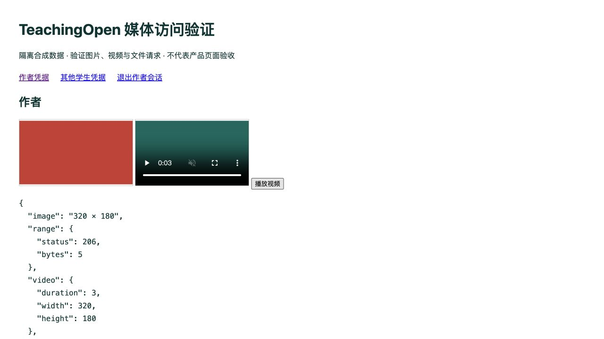

# 本地文件下载授权与浏览器媒体兼容

日期：2026-10-03。分支 `fix/local-file-download-access`，基于 PR #17 的 `a999d45b8f38c2cf2d3c125fc1cd04ba3e285ef6`。

## 问题与结果

旧 `/sys/common/static/**` 完全匿名。隔离环境中的私人作业原始字节可被匿名用户、其他班学生和教师直接下载，HEAD 会返回文件长度，Range 可取得部分内容；路径中的符号链接还可读出上传根目录之外的测试文件。修复前 8 项实际 HTTP/文件检查及清理证据在 `evidence/local-download/before.json`。

现在每次 GET、HEAD 和 Range 都先验证身份及当前资源关系，再打开文件。未登录的私有文件请求返回 401，已登录但无权返回 403；非法、缺失及符号链接路径不提供字节。静态下载规则位于可配置排除项和通用扩展名匿名规则之前，URL 参数不能充当登录凭据。

- 本地有效文件记录的上传者及 admin/dev 可读取。正常作品按既有作者、本班教师和已发布状态 3/4 规则共享附件；取消发布后重新请求立即拒绝。旧版本只向当前作品作者及本班教师开放，不随当前作品公开。
- 首页展示课程的封面、地图和介绍图片继续公开；普通课程及单元媒体检查当前课程权限，四种学生显示开关均要求明确开启。旧课程/单元删除字段为 NULL 的记录兼容，标记删除的不授予访问。
- 附加任务按精确班级成员关系及开启状态授权，管理教师按所管理班级读取。已启用站点配置、已发布新闻的明确资源引用可公开；头像必须对应其用户自己上传的文件记录，不能借头像路径公开他人对象。
- 数据库的字符串包含查询只用于找到候选，授权仍比较完整对象 key 或配置的静态 URL；不会因路径子串或外部域名中出现同一路径而授予权限。MySQL 不区分大小写的查询结果会再按实际 key 精确比较。HTML 的 src/href/poster 和 JSON 字符串值支持已知资源结构。
- 登录及成功的 JWT API 请求签发仅用于静态下载路径的会话 Cookie，HttpOnly、SameSite=Strict、host-only；HTTPS 请求附加 Secure。仅媒体过滤器接受此 Cookie，普通 API 仍要求原 X-Access-Token。请求头优先于 Cookie，失效或歧义凭据不会降级匿名通过；退出清除 Cookie，服务端撤销后复制的旧 Cookie 也不能读取私人文件。令牌不进入文件 URL、页面或测试证据。
- 文件流只在上传根目录内读取，拒绝所有子路径符号链接；按单个字节范围进行有界读取并关闭文件句柄。支持起止、开放末尾、后缀以及超大末尾截断；无效/无法满足的范围返回 416，HEAD 忽略 Range 且无正文，多范围/未知单位/无法匹配的 If-Range 返回完整实体。图片、视频、音频和 PDF 使用适合浏览器的 MIME；HTML/SVG/JS 等主动内容强制附件并使用 nosniff/sandbox。所有下载响应 no-store，防止缓存绕过撤回后的重新授权。

行为依据：[RFC 9110 Range 规则](https://www.rfc-editor.org/rfc/rfc9110.html#name-range)、[Set-Cookie 属性](https://developer.mozilla.org/en-US/docs/Web/HTTP/Reference/Headers/Set-Cookie)。

## 验证与复现

最终专项 **88/88**；同一 JAR 上九组前置回归 **906/906**（文件归属 76、上传 46、共享附件 41、学生提交 95、社区 235、作业管理 134、学习单元 80、课程管理 188、角色缓存 11）。这些是组合重跑，不计为新增独立用例。浏览器 5 项观察，记录 20 个实际媒体请求：作者图片正常解码、3 秒视频播放至结束，其他学生 403、退出后 401；临时验证服务器与文件已清理。原源码 5,634 个文件摘要未变，三个既有后端健康及首页预览正常。



最终 JAR、构建结果、专项及组合检查摘要见 `evidence/local-download/candidate.json`。脚本核对运行进程、JAR 摘要和隔离数据库/Redis，使用真实本地 API 与合成身份，不连接生产。

```sh
python3 api/dev/verify-local-download.py --runtime /absolute/path/to/course-role-runtime --output /tmp/local-download.json
python3 api/dev/serve-media-probe.py --runtime /absolute/path/to/course-role-runtime --output /tmp/browser-media.json
```

第二个命令在 127.0.0.1:18113 开启临时媒体验证页，使用本机 ffmpeg 生成单色 PNG 和 3 秒 MP4。测试进程在真实 API 登录后，将后端实际签发的 Cookie 响应转交浏览器；图片、视频、HEAD 和 Range 请求由浏览器自行携带 Cookie，不注入媒体请求头。页面有作者、其他学生、退出三个控制项。Ctrl-C 或 SIGTERM 停止并清理合成文件/记录及会话，最久 20 分钟自动结束。该页面是受控媒体兼容检查，不是产品登录页、真实验证码 UI 或完整编辑器验收。

同一数据库的各行为套件串行执行，临时业务记录、目录外测试字节和符号链接都在清理后复核。Maven 父 POM 仍跳过 Java 测试，实际行为证据来自独立 HTTP/SQL/文件脚本，不能把打包成功称为测试通过。本项无前端产品样式变化，未重复前版 UI 或前端静态检查。

## 使用边界

本地媒体应通过与应用同源的 `/api/sys/common/static` 代理提供。Cookie 不跨独立媒体域名使用；独立域名、跨站嵌入、外部 Office 转码抓取私有文件需另设计授权传递，不提供匿名兼容后门。HTTPS 反代必须让应用正确识别安全请求。多个同主机的本地实例用不同 `jeecg.media.cookie-name`，因为 Cookie 不隔离端口；本地模板按后端端口生成名称。未改生产配置。

没有修改数据库结构或迁移历史作者。未知模块、未登记的孤立文件及无法确认的 URL 形式默认不向普通用户开放，可由管理员核对恢复；CSS url()/srcset、自定义资源 JSON、独立可选课程资源库及素材库的旧资源关系不在本次普通用户授权覆盖内。课程作业答案仍沿用现有 API 的课程可读契约，答案发放规则未在本项重定义。重复历史路径、错误作者和管理员信任边界仍需单独处理。

每个请求实时查询当前关系；复杂富文本候选查询尚无大数据量性能结论。上传目录须只由应用和受信运维写入；不宣称抵御具备本机目录写权限者的并发父目录替换。撤回不能收回已经下载或正在传输的字节。没有七牛/CDN 私有桶、持久缓存迁移、云上传或容量验收结论。旧会话若使用失效 Cookie，首次媒体请求会收到 401 并清除 Cookie，重新登录或有效 API 请求后恢复私人媒体凭据。

完整学生编辑器、教师/管理员浏览器流程、故障恢复及 UI 人工评阅仍在总目标内。当前候选只在 18111 运行，18102 的公共 UI 预览保持原分支。回退旧 JAR 不需要数据库回退，但会重新开放旧匿名下载入口，不能将其作为保留新增权限边界的方案。未合并、未部署。
