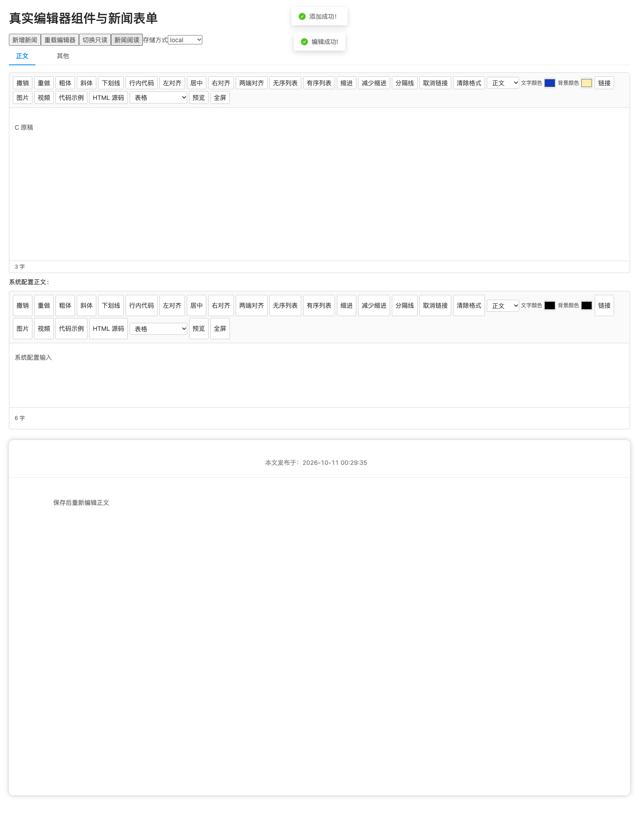
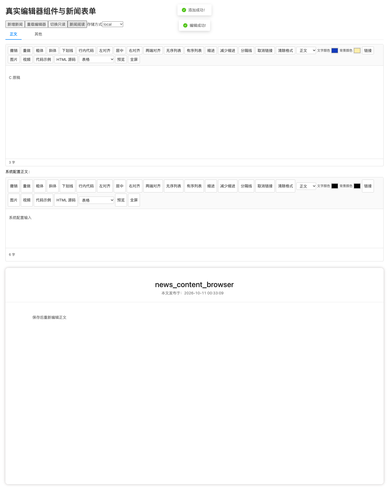

# 资讯公开详情标题与编辑器浏览器补验

2026-10-11，北京时间。基线为 `0142a849d7b509e9c614d7219a5dc5ca51a63af7`。

## 问题与修正

真实浏览器保存资讯后，公开详情的正文正常，但标题为空。接口与实体使用 `newsTitle`，`NewsDetail.vue` 的标题模板却读取 `cmsTitle`。本次统一为 `newsTitle`，并给已有浏览器验收程序增加从 MySQL 保存记录读取公开标题、正文的断言；保留 Vue 文本插值及正文清洗。

## 实际检查

- 当前基线的 Chrome 组件浏览器检查为 51/51，但视觉复核发现标题遗漏，因此没有把该数字当作完整通过。修正候选增加标题断言后为 **52/52**，无未捕获浏览器错误。
- 浏览器覆盖实际输入、富 HTML 粘贴、格式/源码编辑与清洗、本地图片和视频上传、故障重试、记录保存与重开、撤销历史隔离、匿名公开详情标题和正文。
- 使用实际 `JEditor`、Ant Design 表单、`TeachingNewsModal`、`NewsDetail`，以及从固定基线构建的 Spring/Shiro/MySQL/Redis 合成后端。最小探针页面替换字典控件与应用 HTTP 包装器（仍通过真实 Axios 请求后端）；七牛云响应、网络故障/延迟与延迟上传回包竞态单独模拟，历史攻击 HTML 通过组件状态注入。视频使用合成字节，检查覆盖上传及节点插入，未验证播放。没有连接生产或七牛云，不等同于全站路由或目标环境验收。
- 前端完整 Node 测试 **763/763**，生产构建和首屏体积检查通过。浏览器视口为 **1440 × 1000**，截图保留全页。
- 候选正文与标题来源、浏览器版本、JAR 摘要、逐项结果见 [验证摘要](evidence/news-detail-title/verification.json)。后台仍绑定基线 JAR；后续安全 PR 的整合由相应 CI 与 HTTP 回归另行验证。

此前报告中的 Chromium 下载阻碍在本机通过已有 Chrome 解决。检查另发现旧 `verify-environment.py` 固定要求 69 张表，而当前注册迁移后为 70 张；没有修改该旧工具或将其报告当作全通过。本次后端归属、具体接口与数据检查由实际探针单独核验。

## 视觉证据

修复前，公开正文上方标题为空：

修复后，显示同一类合成资讯记录的 `newsTitle`：

未部署生产；没有执行正式换证、告警投递、限速或跨月恢复验收。
