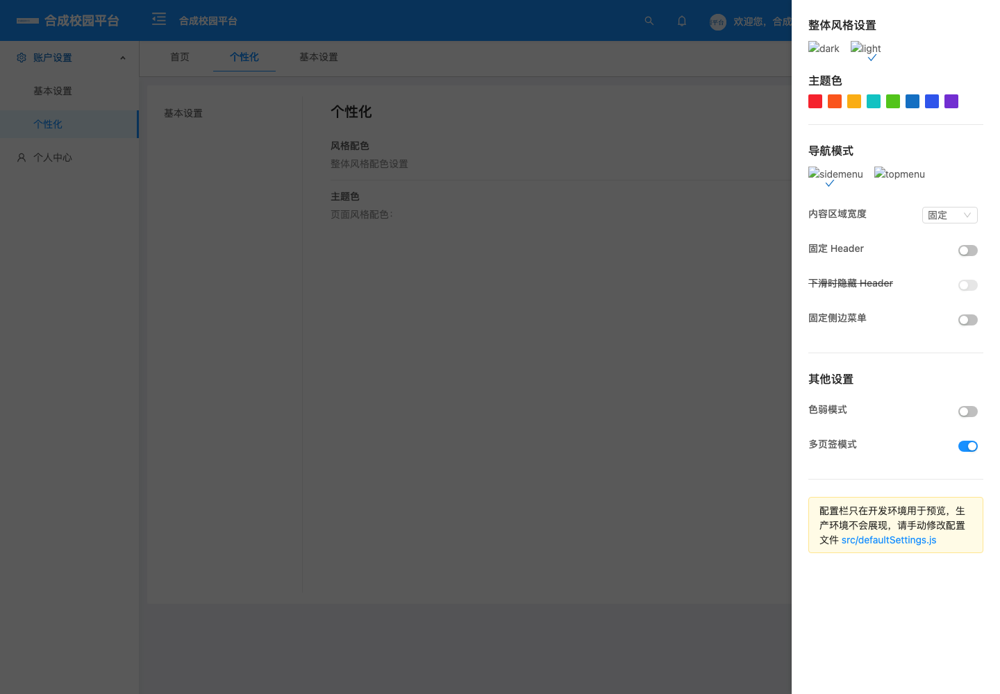
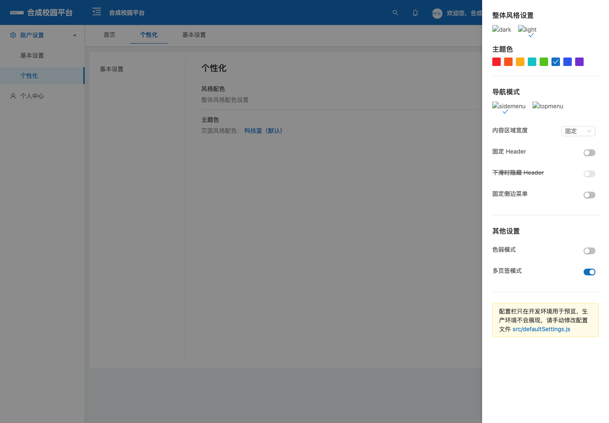
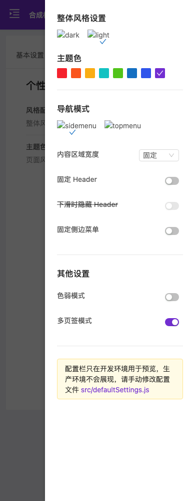

# PR #94 主题审查修复与兼容性验证

本轮基于 PR #94 的 `af54a3b1ab035e73378561ea74d7357e16a88200`，处理 GitHub 中三条尚未解决的 P2 审查意见。修复延续 `feature/neutral-blue-branding`，不修改生产部署，不合并 PR。之前公网预览及其回退资料属于先前发布记录，不能作为本轮修复已经上线的证据。

## 修复行为

1. 启动时在创建 Vue 根实例之前恢复主题。旧版自动保存的 `#1890FF`（含大小写变体）迁移为 `#146fc2`，迁移前值保存在 `DEFAULT_COLOR_LEGACY`；重复启动不改写备份。非默认历史主题与任意自定义颜色原样保留。用户通过设置主动选色时另存 `DEFAULT_COLOR_USER_CHOICE`，因此以后明确选用旧蓝色也不会被自动迁移。其他配置、身份缓存及自定义品牌内容不由迁移函数修改。
2. 设置抽屉按忽略大小写的颜色值匹配选中项，任意自定义色增加对应色块；个性化设置页面显示默认主题名称或“自定义色”，避免无选中项及空名称。
3. GlobalLayout、账户中心、作品详情、新闻、卡片列表、工作台、图片预览及教师报表的应用强调色使用 `--app-primary-color`，回退到项目主题配置；图表的独立颜色和调用方指定颜色保留。账户中心成员区与图片预览树的部分规则在当前模板中未使用，证据为样式清理和真实 Less 编译，不宣称这些状态已在当前页面实景出现。
4. 运行时主题编译等待 Less 初始默认编译完成后再应用用户颜色，并串行处理连续选择，避免默认样式后完成时覆盖用户主题。加载或编译失败会关闭提示，后续选择仍可重试；设置抽屉允许重选同色。
5. 页眉 10px 副标题改用 `#fff`，背景保持 `#146fc2`。实际配色对比度从 4.451705:1 增加到 5.143871:1，超过普通小字 4.5:1 门槛；600px 及以下继续隐藏副标题，布局和字号不变。

历史缓存没有主动选择的来源记录，无法区分“过去手选了旧默认蓝色”与“程序自动保存旧默认蓝色”。迁移按原审查要求只处理这一个旧默认值；保留原值并给新操作增加来源标记，不能追溯恢复历史上不存在的信息。

## 工程与独立复核

- 全套前端测试：725/725，无跳过，较原提交新增22项回归。
- `theme-preference.test.cjs`：8项，覆盖旧默认大小写、新浏览器、空缓存、所有原有备选色、任意自定义色、重复启动、显式旧蓝选择、备份及其他缓存保护、设置选中项、真实启动代码与抽屉挂载顺序、同色重新选择。
- `theme-color-coverage.test.cjs`：6项，实际编译相关 SFC 的 Less，检查具体选择器输出；执行真实教师报表日期插槽和 AntD DateTBody，验证月初作为日期范围起点或终点时仍保留内联主题边框，保留图表自定义颜色。
- `theme-compilation.test.cjs`：7项，执行真实主题编译模块，用受控 Promise 验证等待初始化、加载前后连续切色串行、编译失败后的队列恢复、脚本错误/API缺失后的重试及提示收起。首次刷新 Promise 直接拒绝仅为防御分支；真实 Less 3.8.1 会吞掉初始化拒绝，后续 `modifyVars` 失败仍会报告并允许重试。
- `masthead-contrast.test.cjs`：1项，从真实 SFC 读取配色并计算未四舍五入的对比度，要求至少4.5。
- 既有启动和移动表格测试加载真实主题恢复模块及项目 Less 配置，不用空桩跳过新增行为。
- `npm run lint:changed` 通过；16个涉及源码文件与原提交逐项比较 ESLint 诊断，无新增诊断，历史格式问题未扩大修复。
- 生产构建及初始 JS/CSS 预算检查通过（3,281,774 bytes；gzip 883,997 bytes）。构建仍有既有资源体积、入口体积和 Browserslist 数据过期提示。
- 三名子 Agent 分别承担颜色覆盖实现、对比度实现及迁移/整合技术复核、真实浏览器回归。子 Agent 均显式请求 `gpt-6.1-sol` / `ultra`；主 Agent 的会话元数据为 `gpt-6-astra` / `ultra`。
- 未参与相关实现的 Agent 曾发现教师报表把内联边框改为样式类会被 AntD 选中日期规则覆盖；最终恢复原内联方式，仅替换颜色值，并补充实际日历回归。复核确认该阻塞已关闭。主 Agent 最终独立浏览器复跑还发现了 Less 初始编译覆盖紫色的间歇问题：缓存、store 与设置勾选为紫色，但实际按钮仍蓝色。诊断记录证实 `modifyVars` 完成70ms后，默认编译覆写了同一份 CSS；因此追加等待与串行修复，并补充确定性测试，不能只以偶然通过的一次运行作为证据。

## 浏览器复现方式及边界

`web/tests/theme-browser/` 使用未修改的生产构建和仅监听 `127.0.0.1` 的合成 API。旧产物来自修复前保留的 `af54a3b1` 构建，报告记录入口及应用 JS 的摘要；候选使用本轮最后一次生产构建。真实 Chromium 执行 Vue 路由、缓存、设置组件及 CSS。登录身份与权限菜单为合成数据，没有向真实账户提交登录、业务表单或数据写请求。

浏览器对外请求均阻断；最终回归的外部 Less 脚本 URL 由从原配置 CDN 下载到本机的真实 Less 3.8.1 响应（SHA256 `8772c10968942fc60ca9195b27f764e179be93200f0bb175c02eada650125ab5`），实际编译生产 `color.less`，没有伪造主题编译结果。早期诊断使用了本机依赖版本，最终结论以3.8.1复跑为准。设置抽屉的外部示意图因此会显示加载失败，这不属于主题修复引入的视觉变化。当前配置头像自身有中性色内联覆盖，其实际计算颜色保持不变；GlobalLayout 的残留头像规则通过真实 Less 编译检查，不把移除内联覆盖后的假设状态当作真实可见缺陷。

复跑方式（在 `web/` 下，Playwright 使用已有安装；未增加项目依赖）：

```sh
npm test
npm run lint:changed
npm run build
npm run check:initial-assets
PR94_LESS_RUNTIME=/path/to/less-3.8.1.min.js PLAYWRIGHT_MODULE=/path/to/playwright node tests/theme-browser/run.cjs candidate dist /path/to/output
```

旧产物使用同一脚本的 `baseline` 模式。基线报告中的18/18表示缺陷与控制条件按预期复现，并不表示旧版本没有缺陷：旧默认仍存在、抽屉无选中项、主题标签为空、新闻/作品链接仍为旧蓝、桌面/平板副标题低于4.5。移动副标题隐藏，不把隐藏文字当作通过可见文字对比度验收。

## 本轮浏览器结果

Chromium 151.0.7922.34，最终候选由浏览器 Agent 与主 Agent 各自独立复跑，均为 **67/67** 断言通过，报告 `completed=true`、`status=passed`、`fatalError=null`：

- 桌面1440px恢复旧默认的大、小写缓存；移动390px恢复旧默认并刷新；均只选中新默认，保留原值备份，不再请求旧蓝色的运行时编译。
- 新用户使用新默认；旧紫色、任意自定义 `#24785d`、带明确选择记录的旧蓝均保留，真实 AntD 主按钮计算颜色一致，抽屉各有一个选中项。
- 390px首次打开的新用户通过真实点击选择紫色，刷新后缓存、明确选择记录、勾选与实际 AntD 按钮紫色均保留。检查等待默认编译和用户编译全部完成，再确认实际按钮仍保持紫色，防止只捕捉瞬时成功。没有用强制点击越过遮罩。
- 作品、新闻链接真实悬停计算颜色从 `rgb(24,144,255)` 变为 `rgb(20,111,194)`。
- 1440/768px的10px副标题实际对比度为5.143871:1；390/320px副标题隐藏，四种宽度页眉及文档无横向溢出。
- 公开登录页启动时也迁移旧默认；自定义品牌名称、自定义脚本、其他主题偏好及无关缓存标记保持。
- 无未捕获页面异常；所有API请求只在本机合成服务上执行GET，无真实登录提交、生产写请求或部署操作。

初版18/18缺陷复现与候选67/67回归为两个不同判据。JSON、全尺寸截图、网络和计算样式记录位于项目外层 `output/playwright/pr94-review-20261010/`；主 Agent 的最终复跑另存 `lead-candidate-final/`。工程日志及 ESLint 差分在外层 `.devspace/artifacts/pr94-review-20261010/`。

前后截图使用合成配置，外部示意图已按隔离规则阻断：

| 旧默认缓存进入桌面设置（1440px） | 修复后迁移并选中新默认（1440px） | 移动端选紫色并刷新（390px） |
| --- | --- | --- |
|  |  |  |

## 回退与合并前验收

本轮不改数据库、服务配置、附件、用户资料、服务端品牌定制或生产静态目录。原前端预览目录及发布回退资料未被本轮操作修改。源码通过本轮修复提交的反向提交回退，不重置分支或改写已推送历史。

主题缓存仍使用原 `DEFAULT_COLOR` 字符串格式，旧代码可以读取。确需恢复某个浏览器迁移前的旧默认时，可检查其 `pro__DEFAULT_COLOR_LEGACY` 备份，使用原 vue-ls 方式恢复到 `DEFAULT_COLOR`；先确认当前颜色仍为迁移结果、用户未做后续主动选择，避免覆盖后来设置。新增来源标记和备份不要求清空原有缓存。

合并前仍需用户核对真实历史浏览器上的主题选择与视觉效果，以及实际师生角色的关键教学流程。合成浏览器、工程测试和多 Agent 技术复核不等同于用户的视觉或业务验收；生产发布需要另行按明确授权执行。
