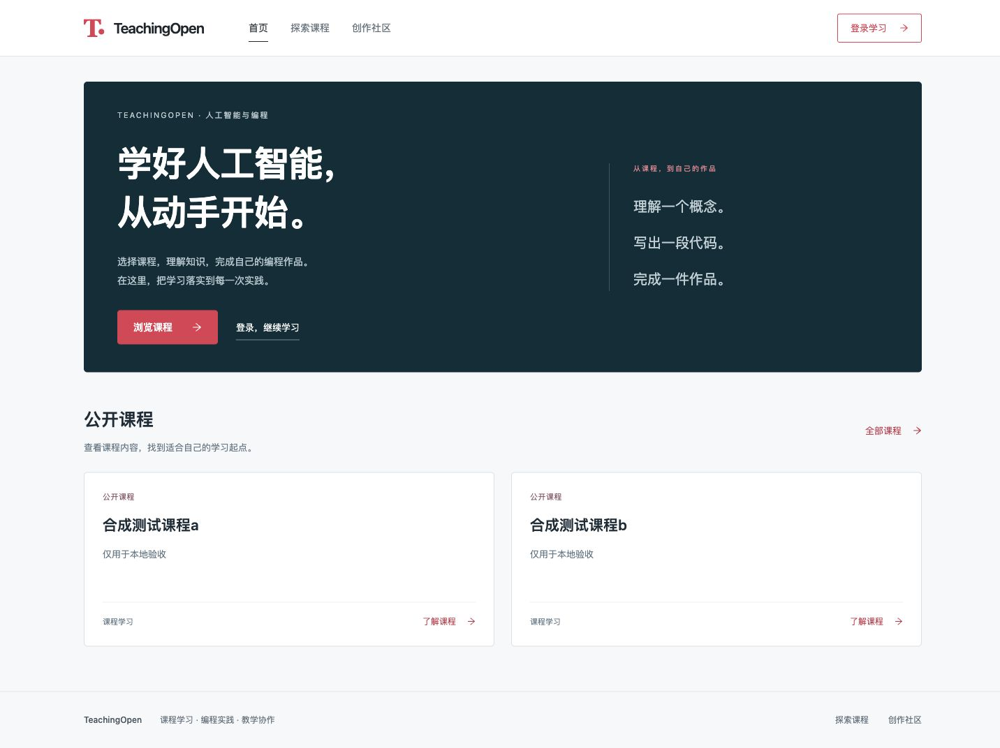

# 公共入口与课程首页

日期：2026-10-02。基于 `main` 的 `2e0c183`，不依赖后端 PR 的代码改动；本地联调使用 #5 的真实后端和独立合成数据。

## 最终行为

没有配置品牌、菜单或首页 HTML 时，默认页面提供完整导航、学习入口、页脚与可操作的公开课程。首页请求第一页最多三门公开课程，名称、简介和分类取自原有接口；卡片打开课程详情，并通过既有登录跳转进入课程。课程请求失败后停止加载、展示重试入口，离开页面后迟到响应不再修改组件状态。

用户认为第一版蓝色圆角卡片视觉廉价，因此本轮依据 [DeepLearning.AI 首页](https://www.deeplearning.ai/) 与 [课程目录](https://www.deeplearning.ai/courses) 重新组织信息和视觉：白色导航、深色主入口、少量珊瑚红操作色、细边框和真实课程内容。没有封面或图片失效时采用完整文字卡片，不放大面积通用占位图。没有讲师、课时、评分等数据时不编造字段。这里参考信息层级和课程呈现方式，没有复制其品牌素材。

手机和平板保留折叠菜单、键盘操作和“跳到主要内容”。配置品牌、Logo、菜单、Banner、页脚与首页 HTML 的路径仍保留；Logo 失败回退为文字标识。首页配置采用响应式 getter，原暖缓存配置切换空白问题的修复也保留。品牌标题仍在完整加载时刷新。

## 当前候选验证

- 固定锁文件安装沿用首版成功结果，没有变更依赖。当前 36/36 项受控检查通过，其中新增四项首页课程请求检查，覆盖重复请求、失败重试、非法响应和销毁后迟到请求。
- 五个变更 Vue 文件显式 ESLint 通过，生产构建退出码 0。仍有既有 CSS 顺序、包体积、Browserslist 数据过期提示，未在 UI PR 内进行框架升级。
- 最终构建接真实 18101 后端，首页 390/768/1440 三种宽度无横向溢出；实际返回两门合成课程。手机键盘展开导航、首页课程详情和保留目标课程的匿名登录跳转通过。
- 实际停止并恢复本轮独立后端：首页出现课程错误及重试入口，恢复后点击重试重新显示两门课程。原 18091 开发环境未用于该故障实验。
- 合成课程配置一个不存在的封面、一个真实本地图片：失效图片被移除，有效图片正常加载，两门课程内容都可读。仅本轮临时文件和字段在检查后恢复，记录见清理证据。

这是本 Agent 的本地工程自检。新版视觉尚待用户审阅，完整角色流程、登录页面自身视觉、原课程目录改版、编辑器与媒体业务仍由后续 PR 完成。服务中断还会触发旧全局拦截器的重复“系统提示”，已记录为后续异常体验问题，不把本页重试通过称为全站异常体验完成。

最终证据：[候选摘要](evidence/public-layout-refinement/candidate.json)、[浏览器观察](evidence/public-layout-refinement/browser-checks.json)、[合成附件与字段清理](evidence/public-layout-refinement/fixture-cleanup.json)。共核对九项浏览器观察，含三尺寸、菜单、详情、登录跳转、故障、恢复、混合封面。

## 截图

| 范围 | 第一版（用户已否定其视觉） | 当前修订 |
| --- | --- | --- |
| 首页 1440px | [旧候选](evidence/public-layout/after-index-1440.png) | [当前](evidence/public-layout-refinement/index-1440.png) |
| 首页 768px | [旧候选](evidence/public-layout/after-index-768.png) | [当前](evidence/public-layout-refinement/index-768.png) |
| 首页 390px | [旧候选](evidence/public-layout/after-index-390.png) | [当前](evidence/public-layout-refinement/index-390.png) |

[真实后端中断](evidence/public-layout-refinement/failure-390.png) · [有效与失效封面](evidence/public-layout-refinement/mixed-covers-1440.png)。图片中的课程、附件和配置均为隔离合成环境数据。

## 既有证据与边界

`evidence/public-layout/` 保留提交 `c8f46ed` 的首版证据，包含原始 main 的改版前截图、32 项受控检查、10 项默认页面检查，以及品牌/Logo/自定义菜单/Banner/页脚/首页 HTML/暖缓存切换检查和恢复证明。这些是此前候选的记录，本次没有重跑完整自定义配置矩阵；不要把历史截图或旧摘要当作本轮视觉验收结果。

## 复现与回退

在 `web/` 按 BUILDING.md 安装固定锁文件、运行 `npm test`、显式 ESLint 与 `npm run build`。可使用 #4 的 `serve-frontend.py --dist <本分支>/web/dist --runtime <独立合成环境>`，访问 `/index`，核对课程接口、详情、失败重试及三个尺寸。故障和临时附件仅在受所有权检查保护的合成环境执行，测试后恢复字段与文件。

未修改数据库结构、API 或权限。回退本 PR 后重新构建前端即可恢复原公共布局；不覆盖原源码工作区的未提交成果，不自动合并或部署。
