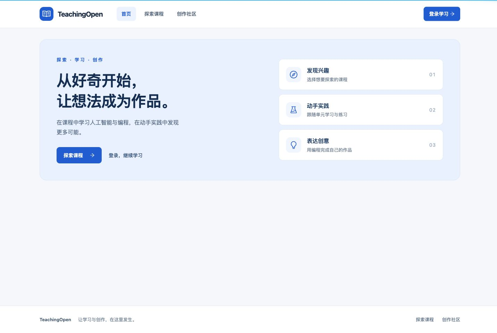

# 公共入口布局与缺配置回退

日期：2026-10-02。基于 `main` 的 `2e0c183`，不依赖后端 PR 的代码改动；本次实际浏览器联调使用 #5 的本地后端候选和独立合成数据。

## 用户可见变化

缺少品牌、菜单和首页 HTML 时，原公共入口缺少清晰导航，首页只有一张欢迎卡；课程页也会先显示约 300px 的欢迎区。现在提供默认 TeachingOpen 品牌、首页/探索课程/创作社区导航、页脚以及完整的首页学习入口。课程、作品列表和资讯页直接呈现各自内容，不再重复渲染欢迎区。

默认视觉统一为浅底、深色文字、蓝色主操作。手机和平板使用可展开导航；菜单切换页面后收起，键盘可以操作菜单和“跳到主要内容”。默认文档标题与品牌一致。配置了品牌和 Logo 时继续使用配置，Logo 加载失败回退到图标和文字；已有自定义菜单、Banner、页脚和首页 HTML 保留。

自检中发现首页组件把配置复制到初始数据后不再跟随后台刷新，导致自定义首页在暖缓存路径短暂变成空白。本次改为响应式读取，真实配置从无到有、从有到无都重新验证。浏览器标题仍遵循原有的启动时设置方式，后台品牌刷新后下一次完整加载更新标题；不将其描述为实时配置编辑器。

## 真实验证范围

- 在独立工作区固定锁文件安装通过，既有 32/32 项课程/启动/菜单受控检查通过；五个变更源码文件显式 ESLint 通过，生产构建成功。没有增加依赖。构建仍有既有 CSS 顺序、包体积和 Browserslist 数据过期提示。
- 最终构建在真实本地后端验证默认首页及课程页的 390、768、1440 CSS 像素宽度；六种组合均无横向溢出。键盘菜单展开、选择课程后关闭、跳转主要内容和进入登录页也通过，共 10 项默认页面检查。
- 在同一独立数据库插入本轮自建的公开配置，检查自定义菜单路由、品牌、失效 Logo 回退、Banner、页脚、自定义首页 HTML。发现的暖缓存空白问题保留在中间观察记录中，修复后双向配置切换通过。
- 只删除本轮插入的配置 ID，配置/菜单表恢复原先的 0/0 条；没有改动主开发环境。测试浏览器临时尺寸已恢复。

这是匿名公共布局和配置兼容性的工程自检，不是完整三角色浏览器业务、人工审美验收或生产验收。课程卡片的封面缺失、课程筛选布局、登录页面本身及作品详情页的旧容器样式继续由后续独立 PR 处理。本 PR 没有宣称这些页面已经统一完成。

证据：[构建、源码与产物摘要](evidence/public-layout/candidate.json)、[浏览器记录](evidence/public-layout/browser-checks.json)、[配置清理](evidence/public-layout/config-cleanup.json)。截图只包含合成课程和本轮合成配置。

## 前后截图

| 页面 | 改版前 | 改版后 |
| --- | --- | --- |
| 首页，1440px | [查看](evidence/public-layout/before-index-1440.png) | [查看](evidence/public-layout/after-index-1440.png) |
| 课程页，1440px | [查看](evidence/public-layout/before-course-1440.png) | [查看](evidence/public-layout/after-course-1440.png) |
| 课程页，768px | [查看](evidence/public-layout/before-course-768.png) | [查看](evidence/public-layout/after-course-768.png) |
| 课程页，390px | [查看](evidence/public-layout/before-course-390.png) | [查看](evidence/public-layout/after-course-390.png) |

新版首页：

[手机版首页](evidence/public-layout/after-index-390.png) · [平板首页](evidence/public-layout/after-index-768.png) · [手机导航](evidence/public-layout/after-menu-390.png) · [自定义配置手机截图](evidence/public-layout/after-configured-390.png) · [自定义首页](evidence/public-layout/after-custom-home-1440.png)

## 复现与回退

在 `web/` 按 BUILDING.md 执行固定锁文件安装、`npm test`、显式检查变更文件及 `npm run build`。可使用 #4 提供的 `serve-frontend.py --dist <本分支>/web/dist --runtime <独立合成环境>` 联调，浏览器访问 `/index` 和 `/courseList`。准备缺配置及上述自定义配置两组状态，核对截图、导航和暖缓存刷新；测试后恢复本轮配置，不能使用生产数据库。

不修改数据库结构、API 或权限。回退本 PR 后重新构建前端即可恢复原公共布局；当前其他分支和主源码改动保留。
