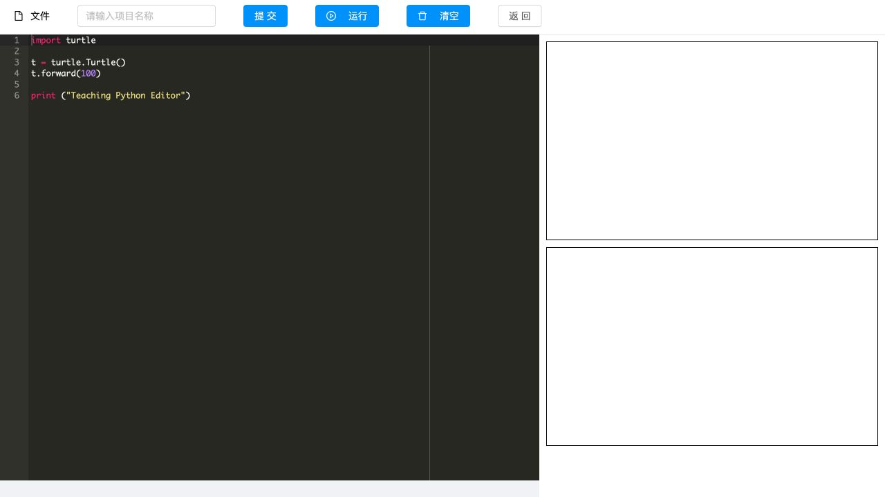
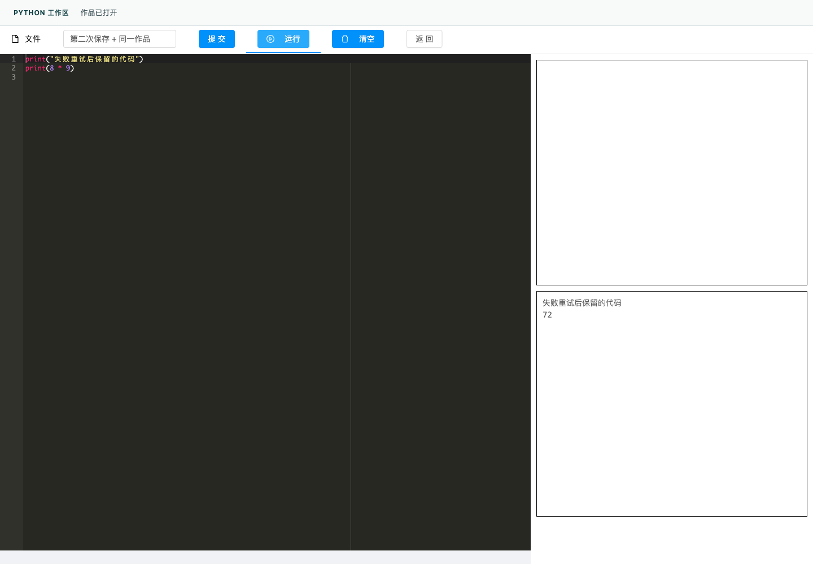
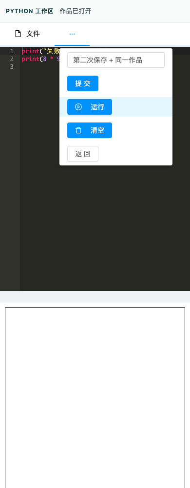

# Python 编辑器保存与重开

从附加作业进入 Python 后，旧页面忽略 `workFile`，会显示默认示例和空名称；没有旧 `CONFIG` 缓存时，提交还会在读取 `domianURL` 时抛错。旧页面保存成功不更新作品 ID，改名再次保存仍发起无 ID 请求。课程链接编码、500 毫秒延迟加载和静默错误也使重开结果不可靠。

本改动以“打开—编辑—保存—重开同一作品”为一个可验收结果。前端基于 PR #25；实际 API 核查使用包含 PR #24 的本地后端候选。未合并或部署。

- 新链接完整编码标题、模板和任务参数；继续与重做都保留已有作品 ID，重做明确选择模板。
- 等待实际 Vue/Ace 编辑器就绪后只加载目标文件；读取失败禁止提交并提供重试，不以默认示例覆盖原作。
- 每次保存使用固定快照，上传、登记、业务提交连续受忙状态保护。成功后记住 ID 并更新当前地址；原样重试复用已登记文件。
- 失败、登录失效和未保存修改有可见提示；代码保留在编辑器。未保存离页有浏览器提示。本地文件导出读取当前 Ace 内容。
- 状态区域采用浅色底、文本层级和语义化状态；编辑区在窄屏上下排列，操作入口沿用原菜单折叠行为。

## 实现范围

主要逻辑保存在可读的 `web/public/python/persistence.js` 与 `editor-bridge.js`。旧项目只提供预编译编辑器，没有相应 Vue 源工程，因此对 `static/js/app.js` 中 PythonEditor 组件做有限挂接：下一轮渲染后初始化、响应式忙状态、按钮和标题禁用、本地导出读取当前内容、文件选择监听器不叠加。组件外的 Skulpt/预编译内容逐段比较一致；player 页面没有桥接时保留旧初始化。后续恢复编辑器源工程仍属技术债。

继续使用同源 `/api`。每次 API 请求读取当前登录令牌；文件读取不向外部文件主机附加平台令牌，私有本地文件沿用媒体 Cookie；七牛使用服务端前缀和短期凭据。没有修改登录、权限、后端代码或生产配置。

## 验证

证据目录：`docs/optimization/evidence/python-editor-persistence/`。

- `npm test`：121/121，含 18 项本次新增检查。覆盖旧行为复现、查询编码、唯一加载目标、连续点击、保留 ID、重做、上传/登记/业务失败、重试、401、HTML 伪文件、导出当前代码、延后挂接和模拟七牛 SDK。
- 修改的 Vue 文件 ESLint：0 error / 0 warning。生产构建成功，仍有 6 项原有警告。
- 真实 Vue/Ace/Skulpt 编辑器 + 本机合成 HTTP 服务：14 条浏览器观察。实际输入代码，两次改名保存仍为 `saved-2`；刷新重开后显示最新内容；503、业务失败和 401 有反馈且可恢复；代码运行输出 72。1440/768/390 宽度无页面横向溢出，390 的折叠菜单可提交。见 `browser-observations.json` 和 `synthetic-http-state.json`。
- 真实 Java 后端 CLI：18/18。实际 multipart 上传与登记、创建与改名更新同一 ID、作品信息重开、仅媒体 Cookie 的文件读取字节一致、匿名提交拒绝、另一学生读取拒绝。测试前后的作品/文件/历史数据和上传字节恢复一致。JAR SHA-256 记录于 `real-backend.json`。
- 浏览器与真实后端 API 是两种分别执行的证据，不能合并宣称为已登录浏览器端到端验收。

复现：

```sh
cd web
npm test
npm run build
python3 tests/python-preview/server.py --port 18120 --directory public
```

预览 `http://127.0.0.1:18120/python/index.html?workId=seed-work`。此服务只提供自编代码样本及内存数据，不代理实际 API、不使用真实凭据；故障模式由 `POST /__mode` 控制。

真实 API 检查：`web/tests/python-preview/verify_backend.py --runtime <隔离运行目录> --jar <已运行候选JAR> --backend-dev <候选api/dev> --output <结果JSON>`。脚本先核验隔离数据库、Redis、运行进程与 JAR 哈希，再使用合成账户。它需要 PR #24 所在后端候选的 FixtureApi 辅助代码。

## 未完成验收与已知限制

- 真实登录浏览器中的学生课程/附加作业全流程仍待完成；当前验证码操作确认尚未返回，本次没有操作验证码或注入登录状态。
- 七牛仅做协议模拟，真实云存储、跨域文件 CORS 和生产定制配置未验收。
- 浏览器中点击本地保存后，下载事件等待超时，因此没有把本地下载算作浏览器验收通过；组件测试确认导出的 File 使用当前 Ace 内容。
- 保存成功响应丢失、跨标签页并发和新建请求的服务端幂等性仍受已有后端策略限制。本次覆盖同一编辑器内的连续点击与失败重试，不宣称跨请求 exactly-once。
- Scratch/ScratchJr 的同类保存问题另行处理。Python 输出区旧 `innerHTML` 写入仍需单独复现评估，未混入本 PR。




