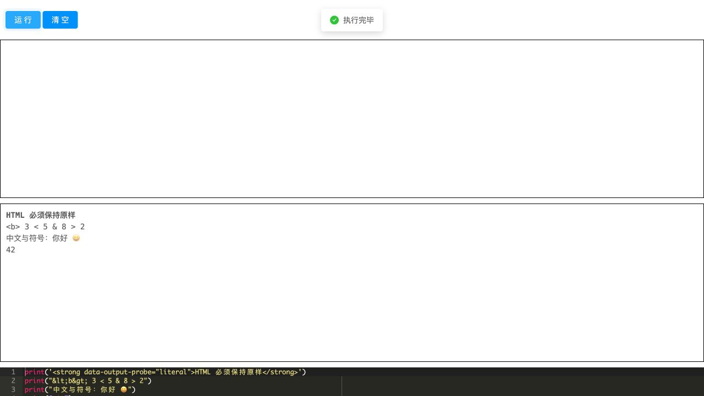
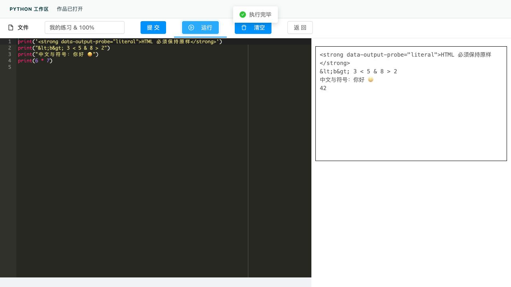
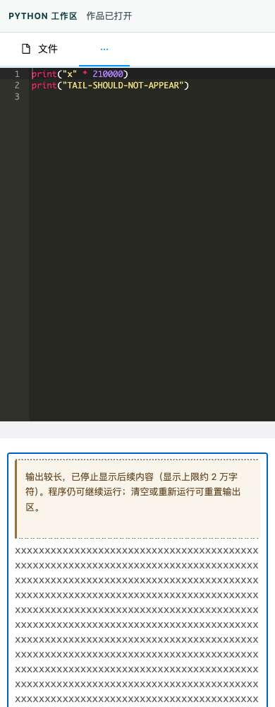

# Python 输出区：纯文本、有界显示与重跑恢复

基于 PR #28 `75586a8`；产品提交 `ae536aee4076737104815c06263c42dbf2250bb3`。本项只修改编辑器和作品播放器的输出路径及其回归资料，不改后端或保存协议。

## 问题与最终行为

两个入口原来都会读出已有 `innerHTML`，拼接 Python 输出后再赋回。实际浏览器运行自制程序，`<strong>` 变成真正的粗体元素，`&lt;b&gt;` 也发生 HTML 解码。逐次打印还会重复解析之前的全部输出。

现在共用可读的 `output.js`：输出只追加到一个文本节点，标签、实体、中文、换行和符号原样显示；超过 20,000 UTF-16 单位后停止追加显示内容，顶部固定提示说明程序仍可运行。有效 Unicode 代理对不会在边界被切断，提示节点最多一个。清空和重新运行同时重置缓冲与提示，海龟画布仍按原行为清空。

输出区可聚焦并在自身范围滚动、长单词可折行；纯文本程序不显示空白海龟画框。正常绘图仍使用原生画布。本轮最初的 200,000 单位方案在窄屏滚动/截图阶段出现超时，因此降低了上限；旧观察保留为中间设计记录，最终证据单列。

继承的 Python 编辑器没有原始组件源码工程。本项限定六处预编译替换：两入口各自的追加、清空、输出区域标签和焦点属性。`web/tests/python-output-preview/vendor-patch.json` 记录前后片段及原文件摘要，自动检查还原替换后的文件与基线逐字节哈希一致；不全局替换运行时中的 DOM/HTML 功能。

## 验证

以下均为同一 Agent 的工程自检，不是独立审核、师生试用或生产验收。摘要和所有证据 SHA-256 见 [manifest.json](evidence/python-output-boundary/manifest.json)。

- `npm test` 159/159，通过 10 项新增边界/实际组件检查及原有用例；共享输出脚本显式 ESLint 0 error / 0 warning。
- 生产构建成功，保留 6 条既有警告，无新增依赖。6 个入口/脚本/样式的源码、dist 与本机 HTTP 字节相同。
- [15 条浏览器观察](evidence/python-output-boundary/browser-observations.json)记录真实编辑器与播放器的文本输出、21 万字符截断、1 万次打印、清空/重新运行、除零错误后的海龟绘图、合成保存重开。`Control+End` 没有移动滚动位置；聚焦输出区后的 `PageDown` 实际滚动成功。没有把未生效的快捷键算通过。
- [1440/768/390 测量](evidence/python-output-boundary/responsive.json)页面没有横向溢出，截断提示在视口内；截图检查最终小缓冲正常响应。使用本机合成 HTTP、无账号与数据库，不等于真实认证全流程。
- 原源码 5,634 项摘要不变；原 18102 返回 200。本轮没有重跑后端套件或修改生产。

原播放器错误解析标签：



修复后保留文本：



窄屏长输出与明确提示：



## 复现

```sh
npm test --prefix web
python3 web/tests/python-preview/server.py --port 18123 --directory web/public --seed-file web/tests/python-output-preview/markup.py
```

打开 `/python/index.html?workId=seed-work` 与 `/python/player.html?url=/fixtures/seed.py` 并运行。另测 `print("x" * 210000)`，验证截断后可清空及运行新代码。可选 `--seed-file` 仅用于 loopback 测试服务，不暴露在产品中。

## 边界

这是输出显示修复，**不是不可信 Python 代码沙箱**。继承的 Skulpt 运行时仍在同源页面中运行并包含 DOM 相关能力；本项没有限制 Python 执行时间、阻止无限循环、实现跨执行隔离或更改语言版本。显示上限也不限制运行时创建大字符串的内存。执行隔离、取消/超时、复杂 Python 项目、真实账号完整流程与容量验收仍是后续事项。预编译工程长期维护仍需找回源码或独立规划迁移。

PR 保持 Draft，未合并、未部署；产品化总目标继续 active。
