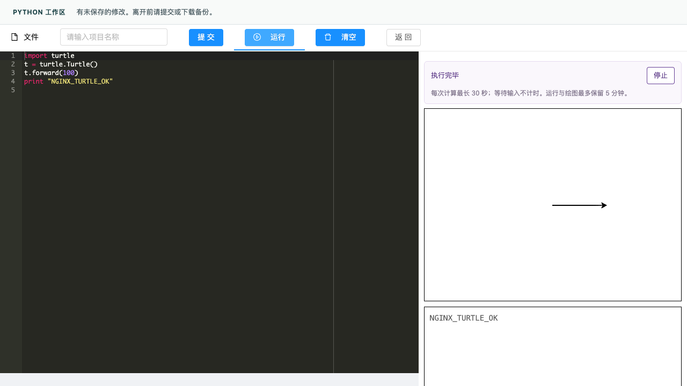
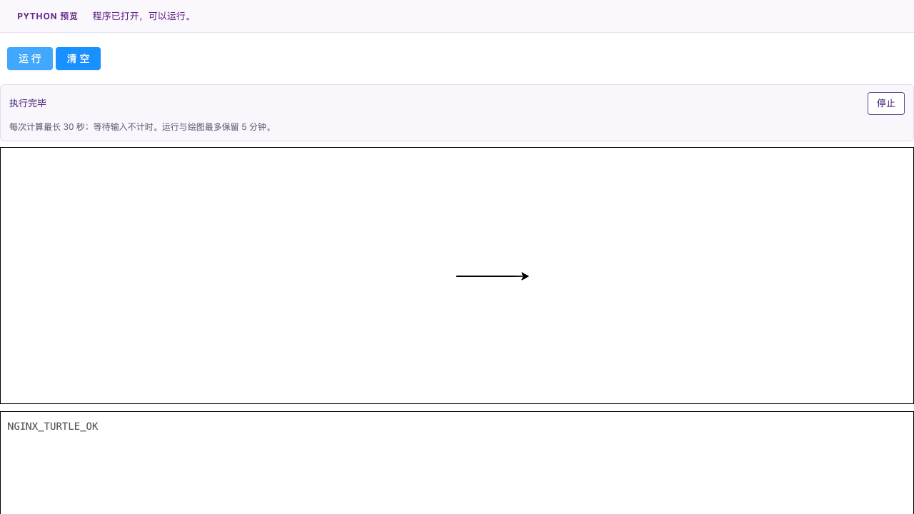

# Python 运行修复接入实际发布候选

日期：2026-10-10（Asia/Shanghai）。目标分支：`codex/registration-acceptance`，基线 `33995e5b41237d552cf21b66eb408623ac830eab`。工作分支：`fix/python-release-candidate`。

## 问题与接入分支

Python 在线运行修复 [PR #87](https://github.com/ZZZZihan/TeachingOpen/pull/87) 已进入 `integration/product-candidate`，但实际发布候选走的是另一条分支。只合入集成分支不会让当前发布候选带上修复。

本次重新读取了 GitHub 远端分支、PR 状态与发布记录：

- 正式数据、注册升级和最终发布包 PR #84、#85、#86 均合入 `codex/registration-acceptance`，后续备份 PR #88、CI PR #89 也进入该分支。
- 本机历史部署记录的源码提交 `fdd10aaaf0c7d006551c466f333703acbaaf8a3e` 是当前目标分支的祖先。这是发布来源的历史证据，本轮没有读取生产主机以确认线上实时版本。
- 首屏优化 PR #90 以 `codex/registration-acceptance` 为目标；CSS 修复 PR #91 叠在 #90 上。两者仍开放，本修复直接从发布目标分支创建，不包含也不依赖这两个 PR。
- GitHub 当前对目标分支要求 `CI required`，要求基于最新分支，管理员同样受约束。提交本 PR 不会自动部署，现有工作流只在临时环境构建和测试。

## 接入内容

将修复提交 `c678c6ac0855bf45a02687f13f2c86c5002aac98` 应用到上述基线，没有冲突。12 个移植文件与原 PR 逐字节一致，包含两份 Nginx 配置、执行协调器/运行器、回归检查及原验证记录。本文件和相邻 `python-release-candidate/` 证据目录记录发布分支上的新验证，原 `python-runtime-policy/` 目录保留历史含义。

两份 Nginx 配置仅对沙箱所需的 8 个公开 Python 脚本/样式设置 CORP 例外，保留其他响应头、API 和附件规则。协调器等待当前 iframe 的加载及运行器就绪后才传递代码；未启动运行器的失败可以直接清理并重试，已经交出代码的执行器仍需要可信停止确认。保留原有 iframe 与 Worker 隔离。

## 当前发布候选的验证

在全新独立工作区用锁文件安装依赖；本机 Node 26.11.0 / npm 11.20.0。GitHub CI 继续使用项目指定的 Node 26.7.0 / npm 11.19.0。

| 检查 | 本次结果 |
| --- | --- |
| `npm test` | 700/700 通过 |
| `npm run lint:changed`；两个运行器 JS 显式 ESLint | 通过；两个 JS 为 0 错误、0 警告 |
| 完整 `npm run build` | 通过，4900 个产物文件；保留 9 条 CSS 顺序警告和 2 类体积提示 |
| Python 源码到生产产物 | 24 个公开文件全部逐字节一致 |
| Nginx 1.30.5 两份配置 | 各 103/103 通过，包含资源策略、其他安全响应头、API 方法和路径 |
| 浏览器使用新生成的 `web/dist` | 两份配置 × 编辑器/播放器 × 6 个场景，24/24 通过 |
| 运行器脚本阻断后重试 | 四组全部通过：明确加载失败、0 Worker 启动、iframe 回收、代码保留，同页点击运行恢复 |
| 海龟绘图 | 四组均完成且各有 2 个画布；Agent 查看编辑器和播放器截图确认线段、箭头与输出 |
| 现有正式发布包完整性测试 | 9/9，通过的是临时合成文件检查，未生成新的正式全量发布包 |

浏览器使用 Headless Chromium 154 和固定官方 Nginx 镜像。配置副本只改变监听端口、静态目录与合成后端地址；容器只读挂载候选，端口仅绑定本机回环。两份 Nginx 实际返回的 48 份 Python 文件与新构建产物哈希一致。输入提交、取消输入、停止、替换运行和纯文本输出均包含在浏览器场景内。

结果与来源见 [summary.json](evidence/python-release-candidate/summary.json)。原始日志、配置环境差异、HTTP 资源哈希与浏览器详细结果保存在项目外层本机 `output/playwright/python-release-candidate-20261010/`，不含真实用户程序或账号凭据。

## 范围、清理与发布边界

原主工作区的 46 个已有修改/未跟踪文件，以及原发布分支工作区的 33 个未跟踪文件，路径、内容哈希和原 HEAD 均保持一致。没有切换或重置原工作区。两个浏览器会话、两个浏览器 Nginx 容器、两个契约检查容器均已清理。

本轮由当前 Agent 实施并自检，不构成独立审核或用户人工验收。没有新增后端、数据库、CI 或备份配置变更；没有执行生产访问、迁移、合并或部署。本地没有重新构建后端 JAR、组合真实数据或冻结全量正式发布包；PR 的远端 CI 另行执行后端构建与临时 MySQL 注册检查，其实际结果以 PR 对应提交为准，不与上述本机结果混同。

后续发布仍需从包含本修复的最终合并提交生成发布产物，同时更新运行器和 Nginx 配置，并保持 `map` 位于 `http` 上下文。此次验证不覆盖所有 Python 库、多浏览器兼容性、真实作品保存提交或操作系统层面的瞬时 CPU 终止。用户本次要求止于验证和 PR，尚未授权部署。
