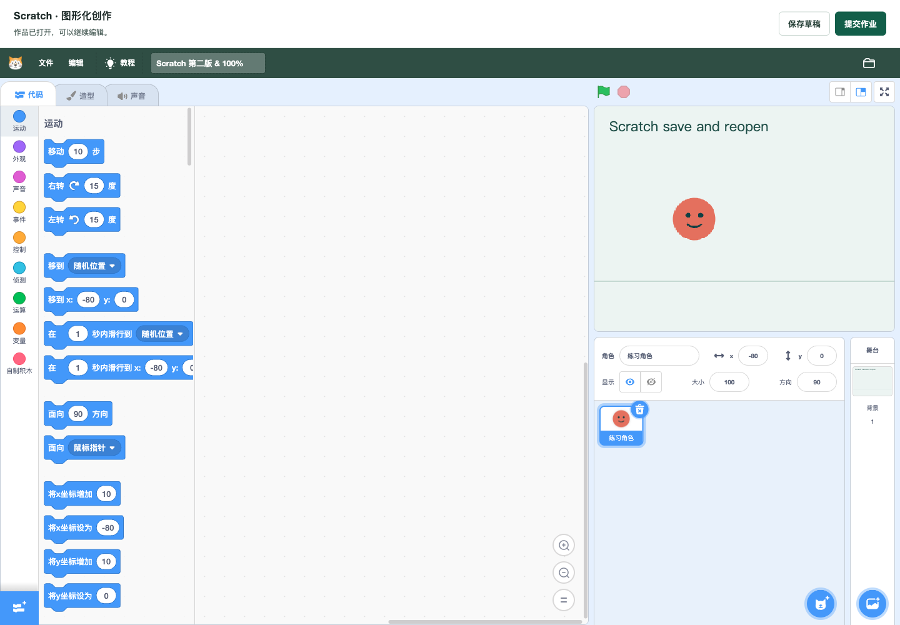
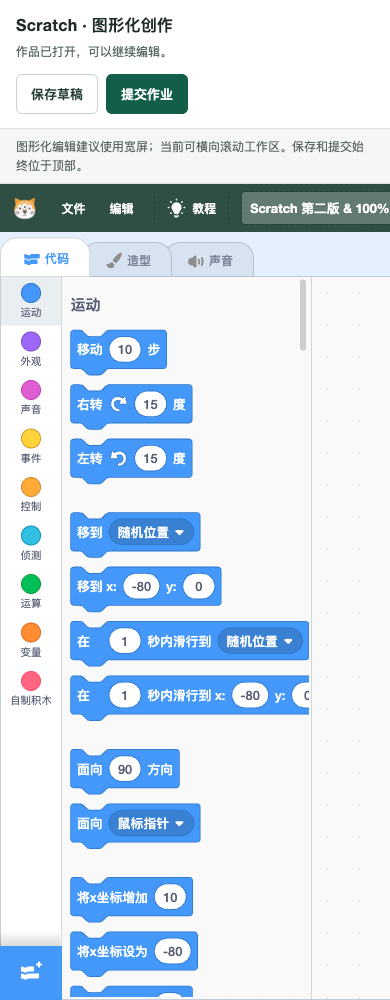
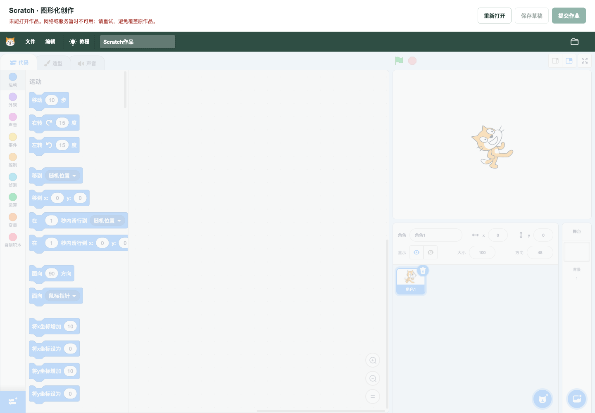

# Scratch 编辑器保存与重开

旧页面会再次解码作品名称，标准编码链接中的 `100%` 触发 URIError 并使整个编辑器白屏。连续保存时，封面和项目文件共用上一轮的全局变量：第二轮封面先返回，就会提交“新封面 + 旧项目”；非云变量作品保存后不记录 ID，成功回调还引用未定义的 `projectTitle`。

本改动以“打开、编辑、保存、重开同一作品”为一个可验收结果。基于前端 PR #26；实际 API 检查使用包含 PR #24 的本地后端。产品提交 `9866188d067e4b5bd5447980df781fd6fb718569`。没有改动后端和生产环境，保持 Draft 等待真实认证流程与视觉评阅。

## 最终行为

- 继续作业优先按已有作品 ID 打开；明确重做才打开模板，保存仍更新同一作品。两种 Scratch 作业入口完整编码名称和文件地址，并传已有 ID。
- 使用原生 Scratch VM 读取/生成项目。文件 HTTP 失败、伪 HTML、解析失败分别进入不可保存的错误状态，提供重新打开按钮，不拿默认示例覆盖失败作品。
- 每次保存先停止运行中的脚本并锁定编辑区，生成该次 SB3 和 PNG；两条上传和登记都完成后才提交。失败时也等待两条操作结束，迟到回调不会混入下一次保存。
- 保存成功始终记录返回 ID、更新地址；草稿和提交分别显示结果。失败保留编辑内容并恢复按钮；离开未保存内容时有提示。
- 状态栏、保存草稿和提交操作固定在工作区上方；移除旧成功二维码弹层，避免把私有提交描述为公开发布。宽度不足 1024 时明确提示使用宽屏，编辑工作区内部横向滚动，顶部操作仍可用。
- 可读逻辑集中于 `persistence.js`、`editor-bridge.js`、`persistence.css`，未修改引擎 `lib.min.js` 或 `chunks/gui.js`。使用内置 Scratch 图标避免旧配置拼接导致破图；去掉此页面的外部错误采集脚本和已无用途的二维码依赖。

本地 API 读取当前登录令牌；项目文件读取依赖同源媒体 Cookie，不向文件主机附加平台令牌。七牛沿用服务端前缀和短期凭据，分别核对项目及封面的返回键和登记路径。没有新增依赖。

## 验证与复现

证据位于 `docs/optimization/evidence/scratch-editor-persistence/`。

- 前端 138/138，新增 17 项：旧混配提交复现、编码、ID/模板/课程优先级、同 ID 更新、忙状态、迟到上传、生成/上传/登记/业务失败、错误文件、401、云 SDK 模拟和未保存提示。修改的 Vue 文件 ESLint 0 error / 0 warning；生产构建通过，保留 6 项既有警告。
- 真实 Scratch 编辑器 + 本机合成 HTTP：15 项新版浏览器观察，另有旧页面白屏复现。实际输入标题并修改角色 x=100→-80，保存后的 SB3 包含对应坐标、PNG 摘要变化，刷新重开显示最新名称和位置；始终更新 `saved-2`。慢上传、封面失败、503、业务失败、401 和恢复分别记录。课程练习实际保存为 `saved-3` 并重开。
- 1440/768/390 截图及 DOM 尺寸记录：页面宽度均等于视口；768/390 的 1024 像素编辑区在容器内滚动，手机宽度实际点击保存成功。没有声称触屏积木编辑体验已经验收。
- 真实 Java API 独立执行 24/24：使用前述浏览器生成的两对 SB3/PNG 实际上传、登记、草稿→提交、改名更新同 ID；读取元数据后仅凭媒体 Cookie 下载的项目和封面逐字节一致。匿名提交、另一学生读取均拒绝。作品/文件/历史行及原上传字节哈希恢复一致。
- 后端为 PR #24 的精确 JAR，SHA-256 `85f7746a3ae4b143f1a4ca4e5c043e11c81bf7d69f32c72b7dbaa190f6a0e85c`。未重建后端或重复宣称全部旧后端套件通过。原源码清单 5,634 个文件摘要不变，三个既有本地后端健康 UP。

```sh
cd web
npm test
npm run build
python3 tests/scratch-preview/server.py --port 18121 --directory public
```

预览 `http://127.0.0.1:18121/scratch3/index.html?workId=seed-work`。夹具只绑定 127.0.0.1，使用自编 SVG/SB3 和内存数据，不代理实际 API、不设置平台登录状态；夹具 CSP 阻止外部采集与云连接。故障通过 `POST /__mode` 切换。`generate_fixture.py` 可重建源样本，`browser-files/` 是浏览器实际生成并用于 API 检查的文件。

真实 API 复现：`web/tests/scratch-preview/verify_backend.py --runtime <隔离运行目录> --jar <已运行候选JAR> --backend-dev <候选api/dev> --fixtures docs/optimization/evidence/scratch-editor-persistence/browser-files --output <结果JSON>`。先核验隔离环境和运行 JAR，再使用合成账户；依赖 PR #24 候选的 FixtureApi 辅助代码。

## 仍待处理的边界

- 实际编辑器配合成 HTTP、实际后端 CLI 是分别执行的两类证据；完整认证浏览器端到端、人工视觉评阅仍未完成。前序验证码操作确认未返回，本轮没有操作验证码或注入认证状态。
- 七牛仅模拟 SDK 协议；真实云存储、云变量、跨域媒体 CORS、背包和生产定制配置仍未验收。ScratchJr 单独处理。原引擎的本地文件导入/导出本轮没有完整浏览器验收结论。
- 同一页面防止重入；跨标签并发、新建响应丢失后的服务端幂等性仍受现有后端策略限制。失败上传/登记可能留下无引用文件，未实现自动回收。
- HTTP/捕获/上传有超时与可恢复错误；引擎内部大型或复杂项目解析、内存压力、扩展和触摸交互没有容量或兼容性结论。
- 保存会停止正在运行的脚本以获取稳定快照。宽屏编辑器布局保留原积木语义色，窄屏提供容器滚动，不宣称完整移动端创作已完成。





