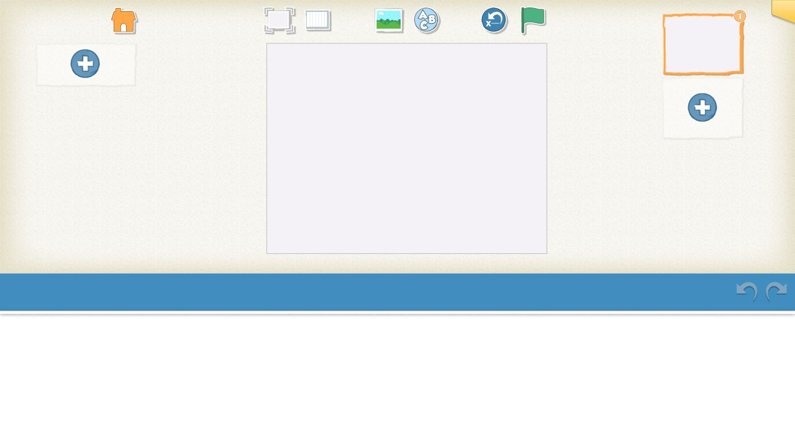
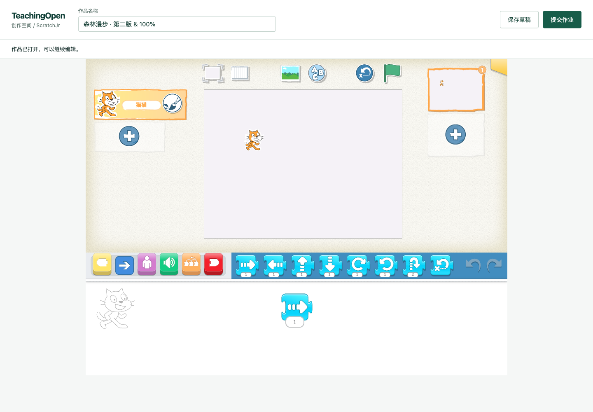
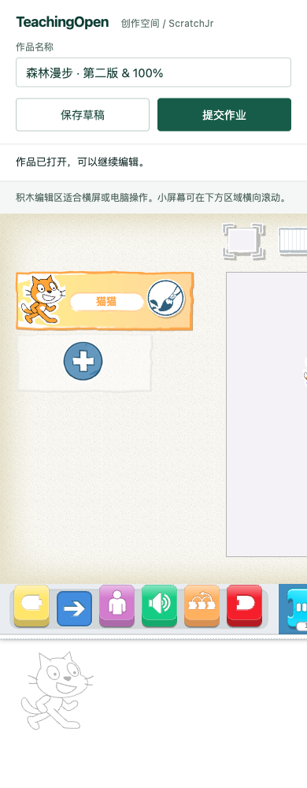
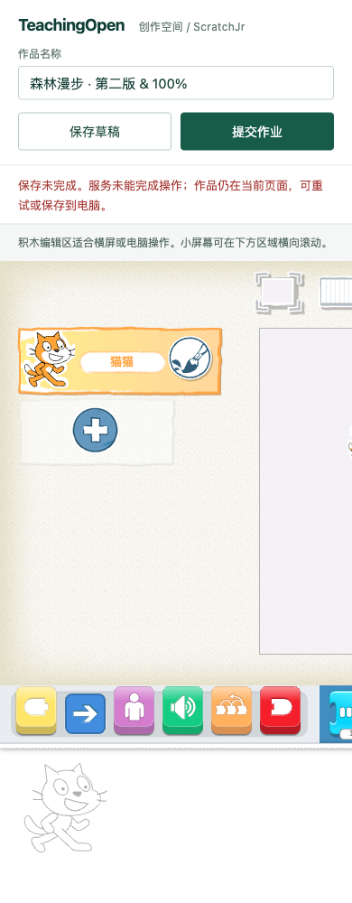

# ScratchJr：作品保存、服务器重开与清晰状态

本项基于 PR #27 的 `45dd581`，产品提交 `2e104cfb989c335e32ffff7775ea0a7cdfb13e53`。只修改前端与本地检查资料，后端仍使用 PR #24 的精确 JAR。目标是让 ScratchJr 作品在实际编辑、草稿保存、改名提交、刷新重开之间保持同一份数据。

## 已复现的问题

旧页接收平台 workId，却只按浏览器本机 pmd5 或文件地址加载；实际传入合成 workId 后打开空白项目，没有请求作品信息。旧保存逻辑共享全局上传结果，第二轮 PNG 先返回时会把新封面与旧 SJR 组合提交；返回的新作品编号也未写回。基线脚本检查保留了混用文件对的重现。旧 Web 引擎还引用不存在的 `fcn`，修复这个错误后进一步暴露重复初始化导致双份工作区的问题。

## 最终行为

- 以平台 ID 读取作品类型、名称、最新文件和课程/任务绑定；已有平台 ID 优先于陈旧 pmd5。明确重做时使用模板但保留作品 ID。课程没有显式文件时读取单元模板。本机未上传项目仍支持原 pmd5 入口。
- 使用已有 Scratch 保存状态机，补充可配置类型与模板，保留 Scratch 默认行为。新桥接层管理当前令牌、文件请求、原生 SJR/PNG 快照、同轮文件配对、登记检查、草稿/提交状态及单次保存锁。成功后记录 workId 并移除陈旧本机编号和文件地址。
- 文件地址使用媒体 Cookie，不向文件主机附加平台 JWT。七牛沿用服务器签发前缀，真实七牛尚未测试。
- 载入失败不打开空白可写项目；保存失败保留当前编辑内容；显示重试或会话提示。原生“保存到云端”接入同一流程。本机导出入口保留，未将下载计为本项已验收。
- 外层统一作品名、草稿/提交按钮、状态和键盘焦点。原生引擎放在同源 iframe 中，固定 1024×768 的完整画布避免窗口变化使其预处理 CSS 错位；768/390 宽度仅编辑区横向滚动，保存栏仍在视口内。这是桌面积木工作区的兼容方案，不宣称完整手机积木编辑体验。
- 预览模式隐藏提交操作，保留引擎 look 模式；个人作品、任务和教师/公共预览链接编码完整参数。

继承的 `app.bundle.js` 没有对应源码工程。本项限定六处可逆字符串修改：名称读取/写入接口、changed 通知、原生云保存转接、未定义回调修复、Web 接口只初始化一次、导出完成关闭 Saving 提示。`web/tests/scratchjr-preview/vendor-patch.json` 记录每个原/新片段与原文件 SHA-256；回归检查把修改还原后要求与原文件逐字节哈希一致。业务和页面逻辑在可读的 bridge/CSS/HTML 中。

## 验证与证据

所有验证由同一 Agent 工程自检完成，不是独立审查或人工验收。完整摘要及哈希在 [manifest.json](evidence/scratchjr-editor-persistence/manifest.json)。

- 前端 `npm test` **149/149**，含 11 项新增检查及任务入口扩展。MyAdditionalWorkList 显式 lint 0 error / 0 warning；另外五个历史 Vue 文件合计仍有 **211 errors / 685 warnings**，逐项与基线比较没有新增消息，不能称全量 lint 通过。
- 最终 `NODE_OPTIONS=--openssl-legacy-provider npm run build` 成功，6 条既有构建警告。没有新增依赖。
- [18 项实际浏览器观察](evidence/scratchjr-editor-persistence/browser-observations.json)：真实角色库添加猫、拖动位置与运动积木，两版保存/重开、慢上传锁、失败/401/重试、课程新作 ID 与重开、预览、本机旧作和原生云保存。浏览器使用实际引擎和本机合成 HTTP，未登录真实平台。第二版实际生成文件在 [browser-files](evidence/scratchjr-editor-persistence/browser-files)，角色横坐标从 359.33538 变为 120.66462，包含 forward 脚本；不是手工伪造保存结果。
- [真实 API 24/24](evidence/scratchjr-editor-persistence/real-backend.json)：同一组浏览器生成的两版 SJR/PNG 经真实上传、登记、保存、改名重开；同一作品编号与状态保持；仅媒体 Cookie 下载字节相同；匿名和异生拒绝。JAR SHA-256 为 `85f7746a3ae4b143f1a4ca4e5c043e11c81bf7d69f32c72b7dbaa190f6a0e85c`。作品/文件/历史表与上传字节恢复原摘要。
- [三屏宽测量](evidence/scratchjr-editor-persistence/responsive.json)：1440/768/390 的页面宽度无溢出，390 实际点击保存成功。窗口动态变化不再改变引擎画布尺寸。
- [保护核对](evidence/scratchjr-editor-persistence/preservation.json)：原源码 5,634 个文件摘要不变；18091/18101/18111 健康 UP；18102 返回 200。生产未变。

旧版打开：



新版实际作品重开，1440：



窄屏 390 与失败状态：





## 复现入口

```sh
npm test --prefix web
python3 web/tests/scratchjr-preview/server.py --port 18122 --directory web/public
```

从 `/scratchjr/editor.html?queryEncoding=uri&workId=seed-work` 打开；`/__mode` 仅该 loopback fixture 支持错误和延迟注入，生产文件没有这些测试接口。fixture 的 11 MiB 请求限制仅为本地检查保护，不是产品上传限制；后端原配置为 1000MB。本例数据是自制空白模板加浏览器真实编辑，未使用学生资料。

## 仍未验收

真实登录/验证码后的学生全流程、教师/管理员界面、真实七牛、摄像头/录音、本机导入导出、多页复杂项目和资源损坏/存储耗尽仍未验收。失败后无引用文件回收、跨标签并发及新建响应丢失后的幂等性未在本项解决。引擎每次从服务器导入仍可能在 IndexedDB 中新增本机副本，长期清理策略及原始源码工程是后续维护工作。保存序列化仍依赖继承引擎；超时显示错误不等于所有原生异步工作可取消。依赖风险、性能与备份恢复仍属于总目标的未完成条件。

本 PR 保持 Draft，待相应完整流程和视觉评阅；不自动合并、部署或修改生产。
