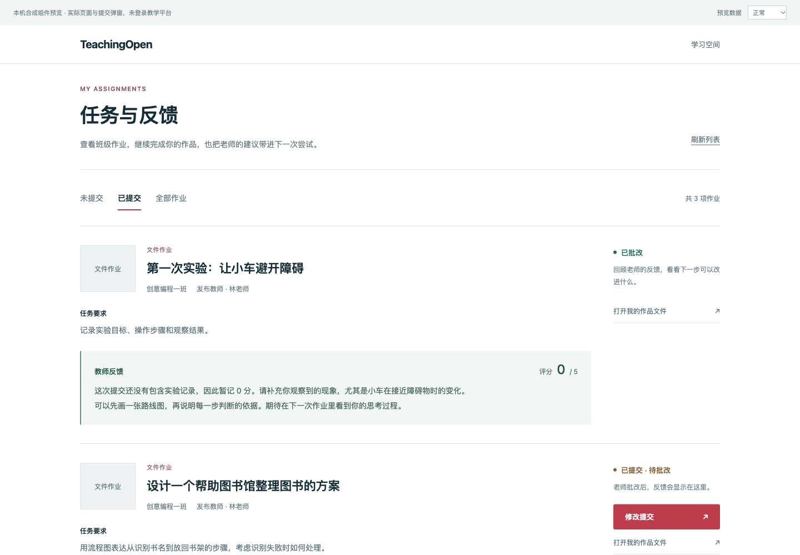

# 学生任务与反馈页面

原附加作业页每行固定 180 像素，作业说明与操作共用狭窄区域；评分为 0 时 `v-if="work.score"` 隐藏整个评分/评语入口，其他评语也只有悬停才能查看。本项把任务要求、提交状态与老师反馈明确组织到同一页，沿用公共学习页的墨色文字、细边框和红色主要操作。

产品及检查提交：`e9ec65e875c0d187c16fe53e51562d61b29e84c1`。基于 PR #23；准确班级范围、提交状态及附件地址依赖后端 PR #24，在本地组合中验证依赖，不将前置修复算作本项成果。

## 行为变化

- 内容随高度展开；桌面任务内容与操作分列，手机上下排列。说明按文本显示并保留段落，缺失/失效封面显示作业类型。
- 草稿、待批改、已批改、公开展示、精选遵循现有字典分别显示。已批改不再显示无效修改按钮；未知状态提示刷新，客户端限制不替代后端授权。
- 教师评语直接可见，0 分和仅文字反馈均保留。评分沿用原教师五级评分控件，没有改变评分规则。
- 未提交/已提交/全部按服务端契约筛选；列表计数来自当前响应。数组在客户端每页显示八项，明确空白、读取、失败和重试状态。保留 #23 的请求版本保护及提交成功刷新。
- 文件作业打开真实 #23 提交弹窗，修改保留当前作品 ID/名称；提供作品文件链接。资料配置失败提示可恢复错误，打开的地址限定 HTTP(S)，新标签页隔离 opener。

## 自检与对照

前端 **103/103** 通过（新增 8 项），修改 Vue 文件 ESLint **0 errors / 0 warnings**，生产构建成功（保留 6 条既有警告）。没有新增依赖、后端修改或 Java 检查结论。准确源码与产物摘要见 [candidate.json](evidence/student-assignment-feedback/candidate.json)。

实际页面、Antd 提交弹窗与上传适配器通过真实 HTTP 连接本机合成服务；未连接平台账号或业务数据库。浏览器检查包括：

- 同一合成作业在 390/768/1440 下前后对照，新版无横向溢出，零分和长评语可见。
- 列表真实 HTTP 503 进入错误状态；独立恢复服务模式后点击“重新加载”恢复五项任务。空列表与失败明确不同。
- 十项作业分页后正确显示第 9/10 项，下一页禁用；键盘 Tab 聚焦筛选有可见轮廓，Enter 生效。
- 文件作业通过真实弹窗上传自制文本、登记、提交后，未提交列表自动 2 → 1；已提交列表 3 → 4，新作业显示待批改。合成服务记录只有一次上传、登记、提交。
- 作品文件在新标签页打开自制文本，原列表保留。缺图回退与 HTTP 404 不阻断列表。

预览外壳为合成导航。旧页面对照的字典筛选和设备 mixin 使用替身；列表、布局和旧评分表达式来自 PR #23 原文件。不能把这些记录称为登录后产品闭环或人工验收。截图共八张：

| 宽度 | 旧版 | 新版 |
| --- | --- | --- |
| 1440 | [before](evidence/student-assignment-feedback/before-1440.png) | [after](evidence/student-assignment-feedback/after-1440.png) |
| 768 | [before](evidence/student-assignment-feedback/before-768.png) | [after](evidence/student-assignment-feedback/after-768.png) |
| 390 | [before](evidence/student-assignment-feedback/before-390.png) | [after](evidence/student-assignment-feedback/after-390.png) |

## 复现与边界

按 `web/BUILDING.md` 使用既有锁文件和工具：`npm test`、`npx eslint --no-ignore src/views/account/course/MyAdditionalWorkList.vue`、`npm run build`。组件预览使用 `node tests/task-preview/build.cjs /absolute/output`，将 `tests/assignment-preview/assets` 的自制文本复制到输出的 `fixtures/`，再运行 `python3 tests/task-preview/server.py --port 18118 --directory /absolute/output`。旧版构建命令尾部传入 `95f5bfe179a7eefe86ca7a2fd41423bc7ba87191`，比较服务器仅绑定本机；本轮旧服务器已停、浏览器临时视口已恢复。

原源码 5,634 项摘要未变。18118 是保留给审阅的组件预览，不是部署。PR 保持 Draft，等待真实认证页面/反馈/文件提交与用户视觉评阅。

源码核查发现编辑器入口仍手工拼查询参数、未传已有作品 ID，Python 内置模板参数读取也需要单独兼容；本项没有改动该路径，下一项需独立修复并测试实际编辑器，不能因页面变好而声称创作闭环完成。真实云、Office 预览、服务端分页、完整三角色、性能与恢复仍待完成。没有 GitHub 合并、生产改动或数据迁移。
