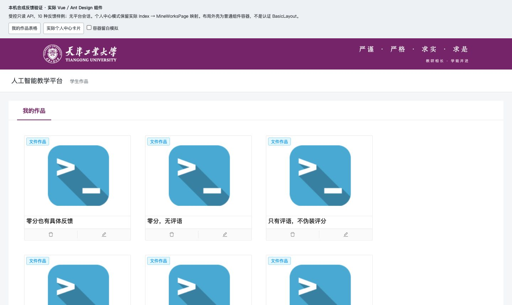
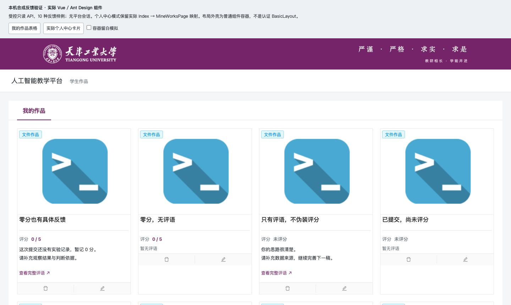
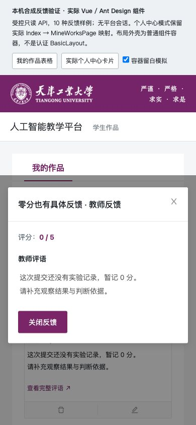

# 学生作品反馈可读性

两个入口现在都能直接看到评分和教师评语摘要，并通过键盘或点按阅读完整内容：`/account/mineWork` 表格和原样 `/account/center → Index → MineWorks` 卡片。零分显示 `0 / 5`，缺失或非法评分显示“未评分”；没有评语时显示明确的空状态。作品和评语更新后会清除旧详情，关闭后快速重开不再被旧动画回调清空内容。

本变更基于 #70，产品提交 `f8071b1ba1a955a1fff517a57212e52e85babc22`。没有改 API、评分/批改规则、权限或真实入口映射。mine 现有多批改行未聚合，本 UI 不声称最新或全部反馈。实现、作者检查及失败修正详见 [作者记录](student-feedback-readable-agent-notes.md)。

## 前后对照

以下均为本机只读合成反馈数据，使用实际 Vue/Ant Design 和两个入口组件。外壳是标注清楚的普通容器，不是认证后的完整 BasicLayout。

原个人中心没有教师反馈：

新个人中心直接显示评分、摘要及全文入口，保留天工紫：

手机全文阅读及键盘滚到长评语末尾：

| 手机零分反馈 | 长评语末尾 |
| --- | --- |
|  |  |

## 实际检查

作者专项13/13、分支597/597；独立编写的真实Vue/SFC离线20/20；集成候选617/617。新文件显式eslint零错误/警告。两旧父组件仍有77错误和227警告（基线82/227），本次不扩大到整页格式清理。最终正式构建成功，12条既有CSS顺序与包大小警告未消失。

CUA检查390/768/1440。旧窄容器表格把390页面撑至569；新表格在390下页面宽390、自身可视310/滚动1420，左右方向键可滚动。卡片390单列、768两列、1440四列，全文按钮最小44px。零分、仅评语、长文本、HTML字面文本、Enter打开、Escape返回焦点通过。1115字长评语可用End滚至末尾，1386字连续字符全文不撑宽弹窗。两父文件最后仅缩进改变，已逐字去空白核对；最终字节另复跑独立20项，并执行390全文键盘检查。预览工具缺全局ellipsis过滤器导致的告警已修正，补入实际过滤器后新预览console无warning/error。普通视口截图曾受浏览器截图比例影响，最终代表图使用完整页面捕获的明确矩形；CSS尺寸来自只读DOM，不根据图片像素猜测。

详细 [浏览器记录](evidence/student-feedback/browser-report.json)、[独立审阅](evidence/student-feedback/independent-review.md)、[20项结果](evidence/student-feedback/independent-offline.json) 分别归属，不将离线或合成组件检查升级为用户验收。

## 组合候选与回退

实际测试及构建候选 `69002a1450306e73f13c7d0763d026dad7b8c335`；后端代码与上一轮相同，沿用JAR `67568eeaecea8e8d7342088767eeef2d7fcee45d61afffa0fb559b7808664016`。新dist4894文件、211848370bytes，清单SHA `83656f53e6674ab211b1754087cd5110cebd93fca7560bff9643d8f175be27ca`。

这份精确组合使用既有#68工具生成全新合成Linux/arm64容器包，真实45/45通过：网络/端口/镜像/挂载、五账号角色API、课程单元持久化与拒绝路径、媒体/附件、中文路径Python草稿、WebSocket及退出撤销。API探针读取自有Redis挑战，不视为普通浏览器登录。没有验证大小写敏感Linux文件系统、Z820运行或真实教师批改后的学生浏览器链路。

三个本机代理18112/18142/18150已提供新dist，初始本地资源24/24与冻结文件一致；外部errlog资源未作为本地资源验证。后端没有重启。旧dist已全哈希核对并完整保留在私有 `student-feedback-20261005/previous-dist`，需回退时只恢复该前端目录；当前Java包不变。容器及合成预览在结束后停止，私有数据保留。真实课程隔离副本18142仍可打开，没有连接或写入生产。

初次容器包输出位置放在输入清单的父目录中，被现有工具边界拒绝，未启动服务；改用独立兄弟目录后create/verify及运行通过。最初静态资源采集只匹配引号路径，遗漏压缩HTML无引号属性，仅核对了首页；改用HTML解析后24份初始资源逐字节核对通过，两次记录均保留。

PR提交只包含本项UI、相关测试、预览工具与合成证据。完整三角色认证、编辑器、人工视觉与目标部署仍有待验收；本地组合通过不代表生产交付。
