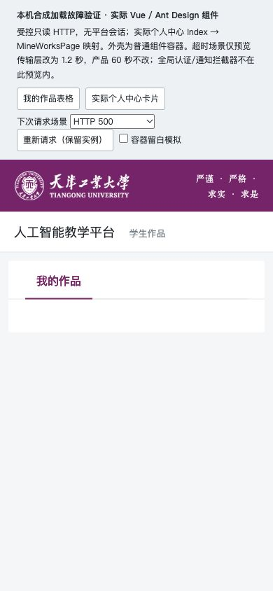
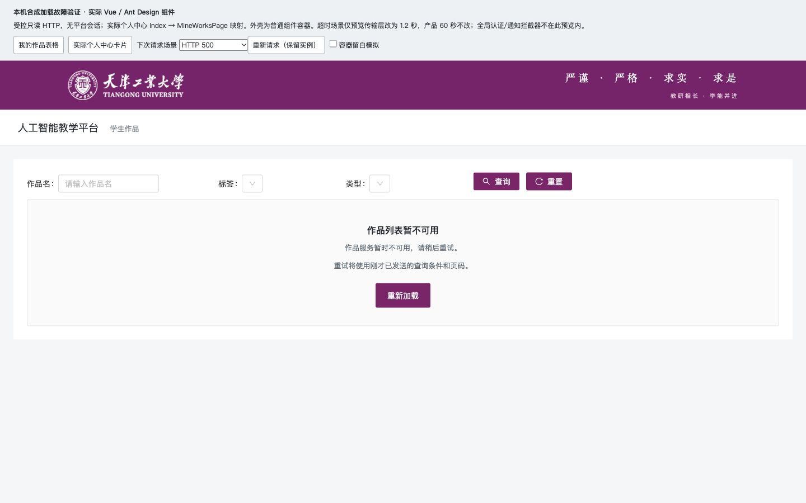

# 学生作品列表加载与失败恢复

学生作品表格在网络错误后可能持续转圈，个人中心可能只剩空白；较早发出的查询也会覆盖后来结果。本项在两个实际入口区分正在读取、读取失败和成功空列表，提供可键盘操作的重新加载按钮，保留天津工业大学主题。

表格重试重复失败时已发送的条件、页码和排序；失败后只编辑未查询的输入不会被偷偷应用。开始新查询清除旧行和选择，只有最新请求可以更新结果，离开页面后旧回调失效。独立列表加载状态避免旧批量操作的 finally 提前结束新列表加载；成功空页仍保留分页入口。表格实例保持挂载，避免 Ant Design 的翻页 nextTick 读取已销毁的引用。

依赖 PR #71，分支 `fix/student-work-loading`，产品提交 `e3522dbc57e10330cbe697ac310e5106231f7aea`。产品改动只有共享状态组件、分页响应与安全错误文案 helper、MineWorkList 表格、MineWorks 卡片四处；后端、全局 JeecgListMixin、全局 HTTP 拦截器、CRUD 方法、个人中心原映射和教师反馈组件均未改。

## 验证与记录

- 作者实际 Vue/SFC 行为 28/28，分支全套 625/625；独立实际 Vue/SFC 最终 35/35，精确旧版 8/8 预期缺陷复现。归属与边界见[作者说明](student-work-loading-agent-notes.md)及本目录 evidence。
- 新增 JS/CJS/helper/状态 SFC 显式 eslint 为 0 错误/0 警告。旧父文件仍有存量问题：表格54错误/154警告，卡片21错误/59警告（此前23/73），没有将旧父文件描述为 lint 通过。
- 根 CUA 在最终 after3 冻结源与合成只读 HTTP 上验证两入口 HTTP500、业务失败、非法数据、断网、短超时、空态、键盘重试、失败条件快照、旧延迟响应、空页翻页及反馈弹窗。390/768/1440 文档宽度均等于 viewport；按钮44px，卡片状态区完整跨列。最终18310来源 console warning/error为0。
- 预览冻结源清单 SHA256：`c33ce3380564a252d606c1e2c4cfc37d0e68eb47de7e9c4d2e5b26e83246ba59`。[最终浏览器记录](evidence/student-work-loading/final-report.json)与[断言摘要](evidence/student-work-loading/final-assertions.json)。

## 候选集成

本地集成 `872109fde9020ab5ad8e42a9cc445f06224589dd` 全套 **645/645** 通过，完整前端构建退出0，仍有12条既有CSS顺序/包体积告警及Browserslist数据过旧提示。新dist **4895文件/211925716字节**，清单SHA256 `9f9a89fb12fc2a3c674988059c86665bcc0a80617bd53b8445f996708b5929da`；三本地代理初始资源24/24逐字节一致，旧4894文件dist已全量保留。后端JAR仍为 `67568eeaecea8e8d7342088767eeef2d7fcee45d61afffa0fb559b7808664016`，没有重建或重启。

最新源码和产物已重新生成可复现私有容器包并离线校验；本轮未启动容器或重跑45项运行探针，上轮精确组合45/45仅属于#71历史结果，不计入本轮验证。真实副本18142匿名首页在新dist切换后仍显示三门公开课程。

## 修复前后

390px 个人中心 HTTP500，旧版空白：

最终版本有明确恢复入口：

桌面作品表格：

## 证据边界与未完成项

浏览器使用真实 Vue、Ant Design、父 SFC、原 Index→MineWorks 映射以及冻结产品源码；外壳、字典/未使用组件、util过滤适配及传输层有明确替代，无平台会话。预览超时缩短为1.2秒，产品60秒未改；本记录不能代表全局认证/通知拦截器、标签查询故障、真实账号或数据库写入链路。既有标签请求的错误处理、卡片大量作品分页另行评估，实际后端默认pageSize=999，未声称仅显示前10。

草稿中实际发现并保留了两项浏览器问题：Less将 `1 / -1` 算为-1导致状态区偏右；表格分页时 v-if 销毁导致 AntD nextTick getBodyTable 报错。最终分别使用独立 start/end 和 v-show 保留实例，重新执行浏览器测试。作者早期预览路径及离线测试夹具失败也保留在作者记录，不覆盖为成功。

原Z820来源的私有课程副本继续在18142供只读内容核验，本次故障服务完全独立。普通认证三角色、编辑器完整链、人工视觉和目标部署验收仍待完成；不自动合并或部署。
